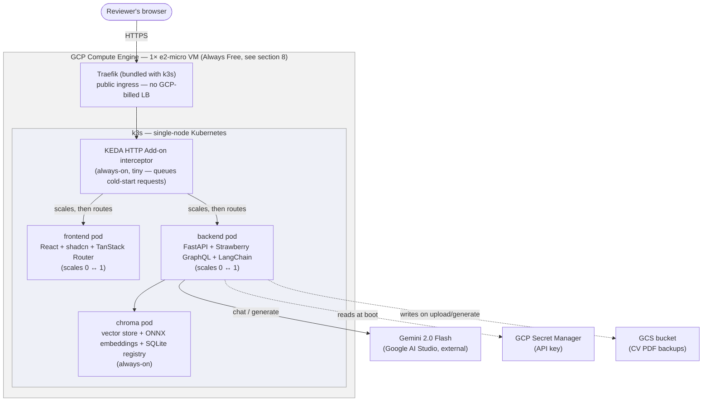
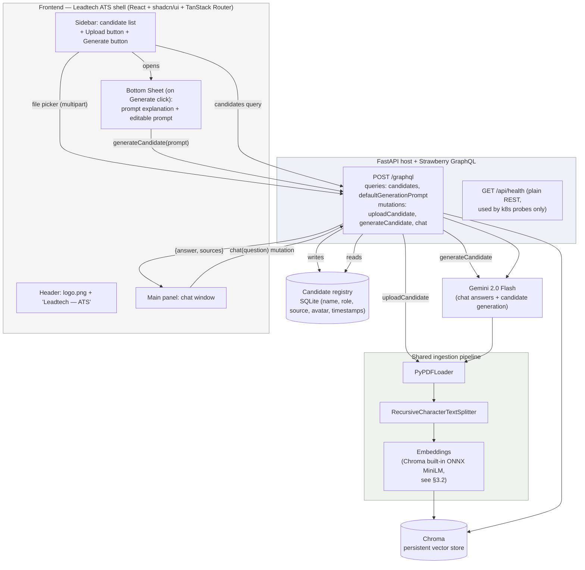
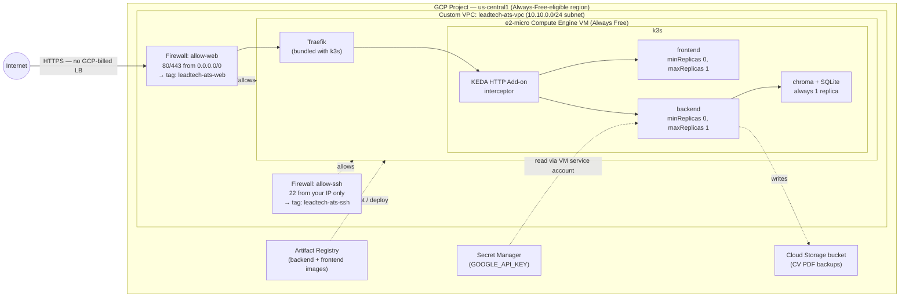
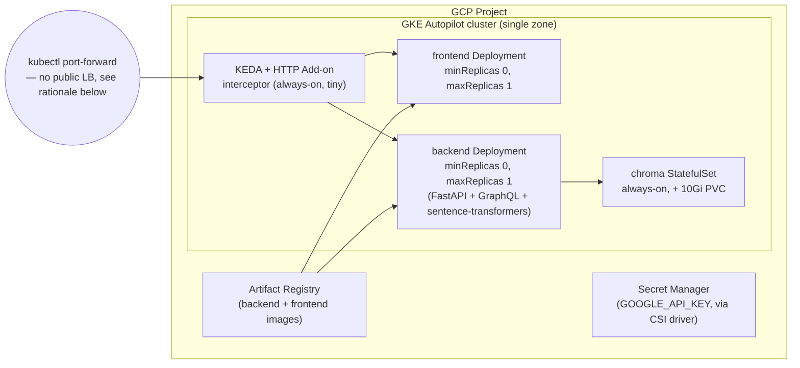

# Leadtech ATS — AI-Powered CV Screener — Implementation Plan

**Source specs:**
- `ai-full-stack-developer-business-case.pdf` (Leadtech — Full-Stack AI Engineer technical task)
- `plan-interface.md` (product/UI/stack requirements: branded SaaS shell, candidate list, upload, in-app CV generation, React + shadcn + TanStack Router + GraphQL)
- `logo.png` (Leadtech brand mark, used as-is in the app header)

**Purpose of this document:** a reviewable, end-to-end plan for a RAG-based CV screening SaaS — built with LangChain, FastAPI + GraphQL, React + shadcn/ui + TanStack Router, and Chroma — deployed to GCP via Terraform and Kubernetes, priced against **GCP's official Always Free allotments**, for use in a job-interview submission.

---

## 0. Scope note

The business case says hosting is optional and warns against over-engineering. Terraform, Kubernetes, and GCP are your explicit addition on top of that — the app is built **container-first** so the same images run identically via `docker-compose` and on the deployed cluster, and the deployment is exercised, not just written and left un-run.

`plan-interface.md` adds two layers on top of the original brief: (1) a branded **ATS SaaS shell** — Leadtech logo + product name, candidate list, upload, and an in-app "generate a synthetic candidate" flow with a visible, editable prompt — and (2) a specific stack: **React + shadcn/ui + TanStack Router + GraphQL**.

This revision reinstates the Always Free tier as the cost basis, now grounded in the **exact allotments from GCP's official Always Free page** (the list you pasted) rather than my earlier recollection — which had gaps worth correcting explicitly: Cloud Storage's own free egress is 100 GB/month, not the 1 GB/month figure I'd conflated it with (that smaller number is Compute Engine's *own*, separate egress allowance, still the real ceiling for serving app traffic — §8.1); and the GKE Always Free credit **only waives the cluster management fee**, never compute/network, which is now stated precisely rather than approximately (§8.7). The architecture is unchanged: one `e2-micro` VM running **k3s** (§8), sized to land at **$0 for everything this app needs**, with a small number of items flagged as worth verifying at deploy time rather than silently assumed (§8.1, §8.6). The GKE Autopilot + KEDA design stays as a documented, priced alternative (§8.7). §1 gives the single-page map of the whole system before the section-by-section detail.

---

## 1. System Overview

The fastest way to understand the whole system: every layer, what technology fills it, where it physically runs, and where to read more.

| Layer | Technology | Purpose | Runs where | Detail |
|---|---|---|---|---|
| Brand / product | Leadtech ATS shell, `logo.png` | Header identity, matches `plan-interface.md` | Browser | §3.3 |
| Frontend | React + Vite + **TanStack Router** + **shadcn/ui** (neutral theme) + **TanStack Query** | Candidate list, upload dialog, generate sheet, chat panel | `frontend` pod | §3.3 |
| API | **FastAPI** (ASGI host) + **Strawberry GraphQL**, one `/graphql` endpoint | Queries/mutations for candidates + chat | `backend` pod | §3.2 |
| RAG orchestration | **LangChain** (loader, splitter, retriever, grounding chain) | Turns CV PDFs into groundable, cited chat answers | `backend` pod | §3.2 |
| Embeddings | **Chroma's built-in ONNX MiniLM** default embedding function | Local, zero-cost embeddings sized to fit the free `e2-micro` VM's 1 GB RAM — see §8.3 for why this replaced `sentence-transformers`/torch | `chroma` pod | §3.2, §8.3 |
| Vector store | **Chroma**, standalone server | CV chunk storage + similarity retrieval | `chroma` pod, on the VM's disk | §3.2 |
| Structured data | **SQLite** via SQLModel | Candidate registry backing the list view | same volume as Chroma | §3.2 |
| LLM | **Gemini 2.0 Flash** (Google AI Studio free tier) | Chat answers + on-demand candidate generation | External API call | §3.1 |
| **Compute** | **1× `e2-micro` Compute Engine VM** (Always Free) running **k3s** | Hosts the entire cluster | GCP, `us-west1` / `us-central1` / `us-east1` (Always-Free-eligible regions) | §8 |
| Scale-to-zero | **KEDA + KEDA HTTP Add-on** | Frontend/backend sleep when idle, wake on request — frees RAM headroom on a 1 GB VM | k3s | §8.2 |
| Public access | k3s's bundled **Traefik** ingress | Public URL, no separate GCP Load Balancer billed (external IP cost verified separately, §8.1) | k3s | §8.2 |
| IaC | **Terraform** (`google` provider) + pinned KEDA release manifests applied by the VM startup script | Terraform provisions VM, VPC, firewall, IAM, Secret Manager, GCS, Artifact Registry; `install-k3s.sh` installs k3s + KEDA (a kubeconfig doesn't exist at `terraform plan` time, so a Helm provider would be brittle here) | Run from your machine / CI | §8.4 |
| Secrets | **GCP Secret Manager** | Holds the Gemini API key, read by the VM's service account | GCP | §8.4 |

**One end-to-end diagram** (everything above, assembled):



**How a request flows, in one paragraph:** a reviewer's browser hits the VM's public IP over HTTPS; Traefik (already running as part of k3s, no extra cost) routes to the KEDA HTTP Add-on interceptor; the interceptor either forwards immediately (frontend/backend already awake) or holds the request while scaling the target pod from 0 to 1, then forwards it. The frontend serves the React shell; its GraphQL calls go to the backend, which runs the LangChain retrieval chain against Chroma (embedding the query with Chroma's built-in ONNX model, no separate ML runtime in the backend process) and calls Gemini for the final answer, citing sources from Chroma's chunk metadata. Chroma and its SQLite-backed candidate registry stay always-on; only the request-facing frontend/backend tiers sleep.

---

## 2. Architecture Overview — Request/Data Flow (application layer detail)

This diagram is the zoomed-in version of the "API" and "RAG orchestration" rows in §1 — the application's internal request flow, independent of which infra it's deployed on.



**Why this shape:**
- **Single GraphQL endpoint** (`POST /graphql`) replaces a multi-route REST surface. Candidate list, upload, generate, and chat become one queryable/mutable schema — the frontend gets exactly the fields each view needs.
- **`/api/health` stays plain REST**, deliberately outside GraphQL — Kubernetes liveness/readiness probes expect a fast, dependency-free HTTP GET, not a GraphQL round trip.
- Upload and generate terminate in the **same shared ingestion pipeline and registry write** — GraphQL changes the transport, not the underlying `ingest_candidate()` / `generate_candidate()` functions.
- **TanStack Router** structures the frontend as real routes (root layout + index route) even though the app is single-page today — scoped to what the app needs, not inventing pages to justify the router.
- **Embeddings run inside Chroma itself** via its bundled ONNX model rather than a separate `sentence-transformers`/torch dependency in the backend — driven by fitting the free `e2-micro` VM's 1 GB RAM (§8.3), explained fully in §3.2, and it happens to also be architecturally cleaner (one embedding runtime, not two).

---

## 3. Component Breakdown

### 3.1 CV Content Generation (shared by the offline script and the in-app "Generate" button)

Goal: 25–30 unique, realistic-looking fake CVs as PDF (photo, contact info, experience, skills, education) — available both as a batch pre-seed and as an on-demand, user-triggered action from the UI.

| Step | Tool | Notes |
|---|---|---|
| Persona/content generation | Gemini 2.0 Flash (Google AI Studio free tier) | A single function, `generate_candidate(prompt: str) -> CandidateJSON`, used by (a) `scripts/generate_cvs.py` for batch pre-seeding, and (b) the `generateCandidate` GraphQL mutation for one-off, user-triggered generation. Returns **structured JSON** (name, title, summary, 3–5 jobs w/ bullet achievements, skills, education, languages). |
| Default prompt + explanation | Stored server-side (`backend/app/rag/prompts.py`), exposed via the `defaultGenerationPrompt` GraphQL query | Returns `{ explanation, template }`, reused by the batch script, the query, and the mutation. |
| Diversity guardrail (batch seeding only) | Prompt design | Varied (role, industry, seniority, city, tech stack) tuples so demo questions have a non-trivial answer set. |
| Avatar photo | A small rotating set of royalty-free/generated placeholder head-shots | Photo realism isn't graded; per-CV image generation is low value for the time it costs. |
| PDF rendering | Jinja2 HTML template + **WeasyPrint** | CSS-styled HTML → PDF. Its system dependencies (Cairo/Pango) add some image size — a non-issue since the free VM's 30 GB disk allotment is generous (§8.1); RAM is the actual constraint (§8.3). |
| Output | `{first}_{last}_{uuid}.pdf`, written to storage and registered with `source_type: "generated"` | |

### 3.2 Backend — GraphQL API + RAG Workflow

| Concern | Choice | Rationale |
|---|---|---|
| Orchestration | **LangChain** (Python) | PDF loaders, splitters, retriever, chain abstractions. |
| PDF parsing | `langchain_community.document_loaders.PyPDFLoader` | Sufficient for text-based, non-scanned CVs. |
| Chunking | `RecursiveCharacterTextSplitter`, ~800 chars / 100 overlap | Keeps each chunk roughly "one CV section" sized. |
| **Embeddings** *(changed from the original sentence-transformers plan)* | **Chroma's built-in default embedding function** — ONNX Runtime + a small ONNX-exported MiniLM model, run **inside the `chroma` process**, not the backend | Zero external cost either way, but this specific choice is what makes the free `e2-micro` VM fit: `sentence-transformers` pulls in PyTorch (300–700MB+ of process memory once a model is loaded), which doesn't comfortably coexist with k3s + Chroma + the backend on 1 GB RAM (§8.3). ONNX Runtime's footprint is a fraction of that. As a side effect, the backend process no longer needs *any* ML runtime — it just calls `collection.add()` / `collection.query()` and Chroma embeds internally — one embedding runtime in the whole system instead of two, a genuine simplification independent of the VM-sizing motivation. (The GKE Autopilot alternative, §8.7, has generous RAM and can keep `sentence-transformers` in the backend if preferred — noted there as a profile-specific difference, not a correction.) |
| Vector store | **Chroma**, standalone server (same container image locally, in `docker-compose`, and on k3s) | One collection (`cvs`), one document per chunk, metadata `{source: filename, candidate_id}`. |
| Candidate registry | **SQLite** via SQLModel, colocated on Chroma's persistent volume | Right-sized for ~30 rows, zero incremental infra cost, single-writer limitation documented in §7. |
| Retrieval | Similarity search, `k=4–6`, optional MMR | Avoids near-duplicate chunks from the same CV dominating a comparison question. |
| Generation (chat) | Gemini 2.0 Flash via `langchain-google-genai`, or OpenRouter free tier | Both named as acceptable free options in the brief. |
| Grounding | System prompt restricts answers to retrieved context, explicit fallback when the CVs don't contain the answer | Main defense against hallucinated candidate facts. |
| Source citation | Retrieved chunks' `source` metadata, deduplicated, returned as a `sources` list on the GraphQL `ChatAnswer` type | Deterministic, not parsed from LLM prose. |
| API framework | **FastAPI** (ASGI host) + **Strawberry GraphQL** mounted at `/graphql` | Schema from Python type hints, native FastAPI/ASGI integration, free GraphiQL explorer in the browser for dev. |
| File uploads over GraphQL | `strawberry.file_uploads.Upload` scalar, implementing the [GraphQL multipart request spec](https://github.com/jaydenseric/graphql-multipart-request-spec) | The one genuinely fiddly integration point of choosing GraphQL — flagged as a deliberate trade-off, good technical-highlight material. |

**GraphQL schema (SDL sketch):**

```graphql
type Candidate {
  id: ID!
  name: String!
  role: String!
  avatarUrl: String
  sourceType: SourceType!   # UPLOADED | GENERATED
  createdAt: DateTime!
}

type PromptTemplate {
  explanation: String!
  template: String!
}

type ChatAnswer {
  answer: String!
  sources: [String!]!
}

type Query {
  candidates: [Candidate!]!
  defaultGenerationPrompt: PromptTemplate!
}

type Mutation {
  uploadCandidate(file: Upload!): Candidate!
  generateCandidate(prompt: String!): Candidate!
  chat(question: String!): ChatAnswer!
}
```

`chat` is modeled as a **mutation**, not a query — it triggers a real LLM call with cost/latency and isn't idempotent/cacheable the way GraphQL queries are conventionally expected to be.

### 3.3 Frontend — Leadtech ATS Shell

| Concern | Choice | Rationale |
|---|---|---|
| Framework | **React** + Vite | |
| Routing | **TanStack Router**, `__root.tsx` (renders `AppShell`) → `index.tsx` (renders `CandidateList` + `ChatWindow`) | Deliberately minimal: one layout route + one index route, ready for a future `/candidates/:id` route without inventing navigation for its own sake. |
| Component library | **shadcn/ui** (Radix + Tailwind), `components.json` with `baseColor: "neutral"` | Constrains the app to black/white/gray/zinc tokens. |
| Data fetching | **TanStack Query**, `queryFn`/`mutationFn` wrapping a thin GraphQL client (`graphql-request`) | One cache (TanStack Query's), not two competing ones (as a heavier client like Apollo would introduce). |
| File upload client | `graphql-request`'s multipart/`Upload`-scalar support | Mirrors the server-side spec choice in §3.2. |
| Layout | `AppShell`: header (logo + name) → responsive two-pane body (sidebar + main) | |
| Header | `logo.png` + `"ATS"` label | Matches `plan-interface.md`. |
| Sidebar | `Button` "Upload candidate" (opens `Dialog`) + `Button` "Generate candidate" (opens bottom `Sheet`), then scrollable `CandidateList` (`Avatar` + name + role + `Badge` for source type) | |
| Upload flow | `Dialog` → file `Input type="file" accept="application/pdf"` → `uploadCandidate` mutation → TanStack Query invalidates the `candidates` query | |
| Generate flow | `Sheet` (`side="bottom"`) → `defaultGenerationPrompt` query populates explanation + pre-filled editable `Textarea` → "Generate" button calls `generateCandidate` | |
| Chat panel | Message list, text input, "Sources: cv_a.pdf, cv_b.pdf" line under each answer, backed by the `chat` mutation | |
| Responsive | Sidebar collapses into a shadcn `Sheet`-based drawer below `md` | |
| Theming — color constraint | Neutral/zinc/black/white scale only; no accent token | **One exception, stated explicitly:** `logo.png` renders as-is (real multi-color brand asset) rather than being forced to grayscale. |

---

## 4. Local Development Setup (fast inner loop, same images as production)

```
docker-compose.yml
├── backend        # FastAPI + Strawberry GraphQL (/graphql) + LangChain, port 8000
├── frontend        # React + TanStack Router + shadcn build served by Caddy, port 5173, proxies /graphql → backend
└── chroma          # standalone Chroma server container (same image used on the k3s VM)
```

```bash
# optional: pre-seed the corpus (also reachable one-by-one via the UI's Generate button)
python scripts/generate_cvs.py --count 28 --out data/cvs

# run the app
docker compose up --build
# → open http://localhost:5173
# → GraphiQL explorer available at http://localhost:8000/graphql for manual query/mutation testing
```

Environment variables (`.env`, not committed): `GOOGLE_API_KEY` (or `OPENROUTER_API_KEY`), `CHROMA_HOST`, `CHROMA_PORT`, `SQLITE_PATH`.

Running `chroma` as its own container locally means the same three-service topology — frontend, backend, chroma — translates 1:1 into the k3s workloads in §8.

---

## 5. Repository Structure

```
.
├── PLAN.md
├── plan-interface.md           # UI/product/stack requirements source
├── logo.png                    # Leadtech brand mark, used in the header as-is
├── README.md
├── docker-compose.yml
├── data/
│   ├── cvs/                    # pre-seeded PDFs
│   ├── app.db                  # SQLite candidate registry
│   └── chroma/                 # local persisted vector index (gitignored)
├── scripts/
│   ├── generate_cvs.py         # batch pre-seed, calls the same generate_candidate() as the API
│   ├── install-k3s.sh          # VM startup script (Terraform metadata_startup_script)
│   └── restore-backup.sh       # manual restore from the latest GCS snapshot, see §8.5a
├── backend/
│   ├── app/
│   │   ├── main.py             # FastAPI app; mounts GraphQLRouter at /graphql + GET /api/health
│   │   ├── graphql/
│   │   │   ├── schema.py       # Strawberry schema: Query, Mutation, types
│   │   │   ├── resolvers.py    # candidates / uploadCandidate / generateCandidate / chat
│   │   │   └── types.py        # Candidate, PromptTemplate, ChatAnswer, SourceType
│   │   ├── rag/
│   │   │   ├── loader.py
│   │   │   ├── chain.py        # retrieval chain (LCEL) + grounding prompt
│   │   │   ├── vectorstore.py  # Chroma client wrapper (embeddings handled by Chroma itself)
│   │   │   ├── generator.py    # generate_candidate(), shared by script + resolver
│   │   │   └── prompts.py      # default generation prompt + explanation text
│   │   └── registry.py         # SQLModel candidate table + CRUD
│   ├── Dockerfile
│   └── requirements.txt
├── frontend/
│   ├── components.json         # shadcn config, baseColor: neutral
│   ├── src/
│   │   ├── main.tsx             # TanStack Router setup (createRouter, RouterProvider)
│   │   ├── routes/
│   │   │   ├── __root.tsx       # AppShell layout route (header + responsive sidebar)
│   │   │   └── index.tsx        # CandidateList + ChatWindow
│   │   ├── components/
│   │   │   ├── AppShell.tsx
│   │   │   ├── Header.tsx
│   │   │   ├── CandidateList.tsx
│   │   │   ├── UploadCandidateDialog.tsx
│   │   │   ├── GenerateCandidateSheet.tsx
│   │   │   ├── ChatWindow.tsx
│   │   │   └── MessageBubble.tsx
│   │   └── lib/
│   │       ├── graphql-client.ts   # graphql-request instance
│   │       └── queries.ts          # gql documents + TanStack Query hooks
│   ├── Dockerfile
│   └── package.json
├── infra/
│   ├── terraform/
│   │   ├── main.tf, variables.tf, outputs.tf   # primary: e2-micro free-tier VM + k3s (§8)
│   │   ├── modules/free-tier-vm/               # e2-micro instance, firewall, startup script
│   │   ├── modules/artifact-registry/
│   │   ├── modules/networking/
│   │   └── modules/gke/                        # alternative scale-up path (§8.7), not applied by default
│   └── k8s/
│       ├── backend-deployment.yaml
│       ├── frontend-deployment.yaml
│       ├── chroma-statefulset.yaml   # also hosts the SQLite file on the same volume, see §8.2
│       ├── services.yaml
│       ├── http-scaledobjects.yaml   # KEDA HTTPScaledObject × 2 (frontend, backend)
│       ├── ingress.yaml              # hostname + TLS routing, Traefik → KEDA interceptor, see §8.2/§8.2b
│       ├── traefik-tls.yaml          # Let's Encrypt via k3s HelmChartConfig, see §8.2b
│       ├── config.yaml               # ConfigMap: bucket, chroma host, CORS origins (§8.2b)
│       ├── backup-cronjob.yaml       # scheduled PDFs + SQLite backup to GCS, see §8.5a
│       └── secret.yaml (templated, not committed with real values)
└── docs/
    └── architecture-diagram.png (or the mermaid source above, rendered)
```

---

## 6. Design Reference — `plan-interface.md` traceability

| Requirement (`plan-interface.md`) | Where it's addressed |
|---|---|
| "Should be a saas with in top the name of company Leadtech — ATS, follow logo.png" | §3.3 Header row |
| "should be responsive" | §3.3 Responsive row |
| "should use shadcn" | §3.3 Component library row |
| "should use react" | §3.3 Framework row |
| "should use tanrouter" | §3.3 Routing row, §5 `src/routes/` |
| "should use graphql" | §3.2 API framework row, GraphQL schema sketch, §3.3 Data fetching row |
| "colors should only black and white and tones of gray" | §3.3 Theming row, exception for the logo asset flagged explicitly |
| "a list of uploaded candidates" | §3.2 `candidates` query, §3.3 `CandidateList` component |
| "a button to upload a candidate" | §3.3 Upload flow, `UploadCandidateDialog`, §3.2 GraphQL multipart upload |
| "a button to gen a candidate, after that should appear a prompt in the bottom with explanation ... and the prompt itself" | §3.3 Generate flow, `GenerateCandidateSheet` |

---

## 7. What Was Cut / Not Built (and why)

- **GraphQL subscriptions** — chat is a request/response mutation, not a streamed subscription.
- **GraphQL code generation** (`graphql-codegen`) — types written by hand against the small, stable schema.
- Candidate **edit/delete** — list + upload + generate + chat only.
- No drag-and-drop upload — a single `Dialog` + native file picker.
- No saved/reusable prompt library for the Generate panel — the edited prompt is single-use per generation.
- No auth or multi-user sessions — single-tenant POC.
- **No fully private VM (no Cloud NAT, no Load Balancer)** — a custom VPC *is* built (§8.2a) for explicit, minimal firewall rules, but the VM keeps its public IP; going fully private is priced at §8.2a's ~$50/month hardened alternative and not adopted, since the POC's threat model doesn't call for it.
- SQLite (not Cloud SQL) for the candidate registry — right-sized for ~30 rows; single-writer is a documented limit, not an oversight.
- **No CI/CD pipeline built out** — the manual deploy sequence in §8.4 is what CI would automate. Worth revisiting: Cloud Build's Always Free tier (2,500 build-minutes/month on `e2-standard-2`, §8.1) would cover this app's build volume comfortably at $0, so this is a "didn't have time," not a "couldn't afford it," omission — a reasonable first addition post-submission.
- **No GKE Autopilot for the default deployment** — kept as a documented alternative (§8.7); the Always Free GKE credit only waives the cluster management fee (not compute/network), so it doesn't change the fact that `e2-micro` + k3s is the only genuinely $0 way to run Kubernetes on GCP for this app (§8.7).
- **No multi-node HA cluster** — a single `e2-micro` is a single point of failure by construction; acceptable for a demo/review deployment, explicitly not production-grade, called out rather than implied.
- **`sentence-transformers`/torch dropped from the default profile** — replaced by Chroma's built-in ONNX embedding function to fit the free VM's 1 GB RAM (§3.2, §8.3); kept as the GKE-alternative's embedding choice where RAM isn't constrained.

---

## 8. GCP Deployment — Terraform + Kubernetes on the Always Free Tier

**This is the actual, chosen deployment target for this POC, priced against GCP's official Always Free allotments** (the exact list you provided). §8.7 keeps the GKE Autopilot + KEDA design as a documented, priced alternative — GKE's own Always Free credit is narrower than the Compute Engine one, which is precisely why it stays the alternative, not the default.

### 8.1 What's actually free, per GCP's own list

Every allotment below is quoted from the official Always Free list you pasted — not recalled from memory — with the specific way this plan uses each one:

| Resource | Always Free allotment (verbatim from GCP's list) | How this plan uses it |
|---|---|---|
| Compute Engine | 1 non-preemptible `e2-micro` VM/month, only in `us-west1`, `us-central1`, or `us-east1`; 30 GB/month standard persistent disk; 1 GB/month network egress from North America (excl. China/Australia) | The entire cluster — k3s, all four workloads — runs on this one VM, sized to its 30 GB disk and, more importantly, its 1 GB/month egress ceiling for actual app traffic (§8.6 sanity-checks this against light demo/review usage). |
| Artifact Registry | 0.5 GB/month storage | Backend + frontend images. Dropping `torch` (§3.2) keeps these small enough (low hundreds of MB combined) to plausibly stay inside this tier. |
| Cloud Storage | 5 GB/month Standard storage, **only** in `us-east1`/`us-west1`/`us-central1`; 5,000 Class A + 50,000 Class B operations/month; **100 GB/month egress** from North America to all regional destinations (excl. China/Australia) | CV PDF backups, a few MB — nowhere close to the storage or operation limits. Note this 100 GB egress figure is Cloud Storage's *own* allowance, separate from — and much larger than — Compute Engine's 1 GB/month figure above; it's irrelevant here since we barely touch GCS beyond small backups, but worth not conflating the two (a correction from an earlier draft of this plan). |
| Secret Manager | 6 active secret versions/month, 10,000 access operations/month, 3 rotation notifications/month | The Gemini/OpenRouter API key. |
| GKE | One zonal Standard **or** Autopilot cluster's management fee waived per billing account/month — **the credit applies only to the cluster fee itself, never to compute, network, or other resources** | Directly why GKE Autopilot isn't the default: even with this credit, Autopilot's pod-second billing and any GKE-fronting Load Balancer are still fully billed. See §8.7 for the numbers. |
| Cloud Build | 2,500 build-minutes/month on `e2-standard-2` | Not built for this submission (§7), but confirms a CI/CD pipeline could be added later at genuine $0 — noted as a "didn't have time" gap, not a cost-driven one. |
| Cloud Shell | Free access, 5 GB persistent disk | A zero-setup way to run `terraform apply` / `kubectl` from the browser if you don't want local tooling — doesn't change any number below, just an operational convenience worth knowing about. |

**Not on this list, and therefore not assumed free:** the external IP address attached to the VM. GCP's Always Free page (as pasted) doesn't enumerate IP addresses as a covered item, and GCP separately introduced an always-billed external IPv4 charge (~$0.004/hr, ~$2.92/month) in 2024 that applies industry-wide regardless of tier. §8.6 prices this explicitly rather than assuming either way — it's the one line item worth a five-minute check in the console before relying on a clean $0 for the actual submission.

### 8.2 Target architecture



**Design choices and why:**

| Decision | Choice | Rationale |
|---|---|---|
| Compute | Single **`e2-micro`** VM | The exact Always-Free-eligible shape (§8.1). Shared-core/burstable, 1 GB RAM — a real constraint (§8.3), acceptable for review-traffic, not for sustained load. |
| Kubernetes distribution | **k3s** (CNCF-certified, lightweight) | Full Kubernetes API (satisfies "should use Kubernetes"), embedded SQLite datastore (not etcd) and a minimal system footprint by design — the only realistic way to run a real k8s cluster inside a 1 GB VM. |
| Public access | k3s's **bundled Traefik** ingress, routed via a GCP firewall rule (not a GCP Load Balancer resource) | Traefik is a process on a VM that's already free — it isn't a *separate*, metered GCP resource the way a GCE HTTP(S) LB forwarding rule is (§8.7 prices that at a fixed ~$18/month, and it has no Always Free allotment at all). This is the same principle as the earlier "no LB" decision, just applied on hardware where a self-hosted ingress adds no incremental bill. Net effect: **a real public URL**, unlike the GKE-alternative's port-forward-only access. |
| Scale-to-zero | **KEDA + KEDA HTTP Add-on** (same charts as the GKE-alternative design), `minReplicaCount: 0` / `maxReplicaCount: 1` on frontend + backend | On GKE Autopilot this saves money directly (§8.7); on the free VM it doesn't change the bill — the VM is free either way, up to its monthly Always Free hour allotment. Kept anyway, **repurposed for RAM headroom**: idle footprint (k3s system + Chroma) is comfortably under 1 GB; adding frontend + backend live only while actually serving a request keeps peak memory use lower and reduces OOM risk under concurrent load during review. |
| Chroma still excluded from scale-to-zero | `chroma` stays always-on | Same reasoning as before — avoids a cold-start ordering race with the backend, and it's already the workload that needs to hold the ONNX embedding model in memory, so keeping it warm avoids reloading that model on every wake. |
| Secrets | GCP Secret Manager, read by the **VM's attached service account** (not the CSI driver used on GKE) | A plain Compute Engine VM doesn't have GKE's Workload Identity; the standard equivalent is an IAM service account attached to the VM, scoped to `secretmanager.secretAccessor` on just this one secret — same "no keys in images/state/YAML" outcome, different mechanism. |
| Container images | Artifact Registry, pulled by containerd on the VM at deploy time | Same as the GKE-alternative; §8.1 covers why image size (dropping torch) matters more here (Artifact Registry's own free allotment is only 0.5 GB). |
| Networking | **Custom-mode VPC** (`leadtech-ats-vpc`), one explicit subnet, tag-scoped firewall rules | See §8.2a — a genuine networking configuration, not the GCP "default" network, at **no added cost**. |

### 8.2a Custom VPC configuration

A dedicated VPC replaces the earlier "just use the default network" decision — here's what it actually changes and what it doesn't.

**What's built:**

| Resource | Config | Why |
|---|---|---|
| `google_compute_network` | `leadtech-ats-vpc`, **custom-mode** (`auto_create_subnetworks = false`) | GCP's "default" network is *auto-mode* — it silently creates a subnet in every region and ships a handful of permissive built-in rules (`default-allow-internal`, and notably `default-allow-ssh` open to `0.0.0.0/0`). A custom-mode network starts with **no subnets and no implied firewall rules at all** — nothing is reachable until explicitly allowed. Moving off "default" is a real, if small, security improvement, not just for show. |
| `google_compute_subnetwork` | One subnet, `10.10.0.0/24`, in the deploy region, `private_ip_google_access = true` | Explicit, versioned CIDR instead of relying on GCP's auto-generated range. `private_ip_google_access` lets the VM reach Google APIs (Secret Manager, Artifact Registry, Cloud Storage) over Google's internal network path rather than through its public interface — free, and slightly reduces what's exposed to the public internet path. |
| `google_compute_firewall` × 2, both **tag-scoped**, not network-wide | `allow-web` (80/443 from `0.0.0.0/0`, target tag `leadtech-ats-web`); `allow-ssh` (22 from your IP only, target tag `leadtech-ats-ssh`) | Tag-scoping (vs. the earlier `source_ranges`-only rules with no target filter) means these rules apply only to instances explicitly tagged with them — the VM carries both tags; any future instance in this VPC starts with **zero access** unless tagged, closing the "I added a second VM and it inherited open SSH" failure mode. |
| VM `network_interface` | Points at the new subnet instead of `network = "default"` | Everything else about the VM (§8.4) is unchanged — same `e2-micro`, same external IP, same k3s install. |

**What doesn't change:** cost (**$0** — VPCs, subnets, and firewall rules carry no charge on their own; you only pay for things layered on top like NAT gateways or Load Balancers, neither of which this adds), or the public-URL story (§8.2) — the VM keeps its external IP so Traefik can still serve the app directly, for the same reasons already established.

**What this is *not*: a private VM.** The VM still has a public IP and is directly reachable on 80/443 — the VPC change is about replacing GCP's permissive defaults with explicit, minimal, versioned rules, not about network isolation. A genuinely private setup (no external IP on the VM at all) is the natural next step and is priced honestly below, rather than silently built and having it break the $0 story.

**Hardened alternative, priced (not built by default):** remove the VM's external IP entirely, add a `google_compute_router` + `google_compute_router_nat` (Cloud NAT) for outbound-only internet access (pulling images, calling the Gemini API, installing k3s), and move public ingress to a Load Balancer or an IAP-tunneled admin path. Real costs, neither with any Always Free allotment: Cloud NAT ≈ $0.044/hr (~$32/month) + ~$0.045/GB processed; a GCE HTTP(S) Load Balancer ≈ $18/month (same figure as §8.7's GKE alternative). Combined, this is roughly **$50/month** of network isolation for a POC whose actual threat model — synthetic CVs, no auth, no PII, torn down after the review window — doesn't call for it. Documented here as the "if this became a real product" next step, not adopted, for the same reason the plan has consistently avoided paying for infrastructure the current scope doesn't need.

### 8.2b Serving: hostname (DNS), TLS, and CORS

The three pieces that turn "an IP with open ports" into a properly served app — all $0, all implemented:

| Concern | Choice | Detail |
|---|---|---|
| **Hostname / DNS** | **sslip.io wildcard DNS** by default; own-domain A record as the upgrade | `ats.<VM_IP>.sslip.io` resolves to the VM automatically — no registrar, no DNS zone, no charge, available the second `terraform apply` finishes (the `app_hostname_sslip` output prints it ready-made). **Cloud DNS was considered and rejected**: it is *not* on the Always Free list ($0.20/zone/month) and buys nothing over a registrar A record for one host. With your own domain: one A record pointing at the VM IP — the reliable path for TLS (below). The hostname is set in two places, deliberately kept in sync: the Ingress `host` rule and the backend's `ALLOWED_ORIGINS`. |
| **TLS / HTTPS** | **Traefik's built-in Let's Encrypt (ACME TLS challenge)**, configured via k3s `HelmChartConfig` (`infra/k8s/traefik-tls.yaml`) | No cert-manager, no extra controller — k3s's bundled Traefik re-renders itself with an ACME resolver, stores certs on a small `local-path` PVC (re-issuing on every pod restart would burn Let's Encrypt rate limits), and HTTP→HTTPS redirect is on. **Honest caveat:** cert issuance on an sslip.io hostname *may fail* — Let's Encrypt rate limits are counted per registered domain and sslip.io's quota is shared by everyone on the internet using it. Own domain = reliable HTTPS; sslip.io = reliable hostname, best-effort HTTPS. The Ingress keeps a host-less plain-HTTP fallback rule so the demo never depends on cert issuance succeeding. |
| **CORS** | Env-driven `ALLOWED_ORIGINS` (comma-separated) on the backend | `*` for local dev (GraphiQL, the vite dev server); locked to the app's exact hostname in the k8s ConfigMap. In production traffic the browser is same-origin anyway (Caddy/Traefik proxy `/graphql`), so the locked-down value is defense-in-depth against direct cross-site calls to the API rather than a functional requirement — which is also why `*` locally is acceptable rather than sloppy. Verified both ways: allowed origin echoes back `access-control-allow-origin`, disallowed origin gets no CORS header. |

### 8.3 The real constraint: RAM, not dollars

Once compute is a free VM, the binding constraint stops being cost and becomes **whether everything fits in 1 GB of RAM**. Rough, conservative budget:

| Component | Approx. resident memory | Notes |
|---|---|---|
| k3s system (containerd, kubelet, Traefik, CoreDNS, local-path-provisioner) | ~300–400 MB | k3s is specifically designed to be lean; this is the floor cost of "real Kubernetes" on this box. |
| `chroma` (ONNX Runtime + small MiniLM model + SQLite registry) | ~200–300 MB | The reason embeddings moved into Chroma's own process instead of `sentence-transformers`/torch in the backend (§3.2) — torch alone can exceed this entire budget. |
| `backend` (FastAPI + Strawberry + LangChain orchestration, no ML runtime) | ~100–150 MB | Meaningfully lighter than the GKE-alternative's backend, which does carry an embedding model. |
| `frontend` (Caddy serving a static bundle) | ~10–20 MB | Trivial. |
| **Total, all four awake** | **~650–870 MB** | Leaves roughly 150–370 MB headroom on a 1 GB VM — real, but not generous. |
| **Total, idle (frontend + backend scaled to 0)** | **~500–700 MB** | The state the VM spends most of its time in — comfortable headroom. |

**Honest framing for the video:** this fits, with real but modest headroom, under light demo/review traffic — exactly the load profile of an interview reviewer clicking around for a few minutes. It is not sized for sustained concurrent load or production traffic. If more headroom is ever wanted, the direct upgrade is `e2-small` (2 GB RAM, ~$12/month — no longer Always Free, since only `e2-micro` is on GCP's list) — worth naming as the explicit next step rather than silently absorbing the extra cost by default, given the whole point of this revision is not assuming costs that don't need to be paid.

### 8.4 Terraform sketch

```hcl
# infra/terraform/main.tf (sketch — not exhaustive)
module "artifact_registry" {
  source     = "./modules/artifact-registry"
  project_id = var.project_id
  region     = var.region
  repo_name  = "leadtech-ats"
}

resource "google_service_account" "vm_sa" {
  account_id   = "leadtech-ats-vm"
  display_name = "Leadtech ATS free-tier VM"
}

resource "google_secret_manager_secret_iam_member" "vm_can_read_llm_key" {
  secret_id = google_secret_manager_secret.llm_api_key.id
  role      = "roles/secretmanager.secretAccessor"
  member    = "serviceAccount:${google_service_account.vm_sa.email}"
}

resource "google_secret_manager_secret" "llm_api_key" {
  secret_id = "leadtech-ats-llm-api-key"
  replication { auto {} }
}

resource "google_storage_bucket" "cv_source" {
  name                         = "${var.project_id}-leadtech-ats-cvs"
  location                     = "US"
  force_destroy                = true
  uniform_bucket_level_access  = true

  lifecycle_rule {                    # auto-prune old snapshots — no custom cleanup code (§8.5a)
    condition { age = 7 }             # days
    action    { type = "Delete" }
  }
}

# VM's service account can write PDFs, generated candidates, and the §8.5a backup
# archive to the bucket — same identity backend and the backup CronJob both use.
resource "google_storage_bucket_iam_member" "vm_can_write_backups" {
  bucket = google_storage_bucket.cv_source.name
  role   = "roles/storage.objectAdmin"
  member = "serviceAccount:${google_service_account.vm_sa.email}"
}

# --- Custom VPC (§8.2a) — replaces "network = default" everywhere below ---
resource "google_compute_network" "vpc" {
  name                    = "leadtech-ats-vpc"
  auto_create_subnetworks = false            # custom-mode: no implicit subnets, no implicit rules
}

resource "google_compute_subnetwork" "subnet" {
  name                     = "leadtech-ats-subnet"
  network                  = google_compute_network.vpc.id
  ip_cidr_range             = "10.10.0.0/24"
  region                   = var.region
  private_ip_google_access = true            # VM reaches Secret Manager/Artifact Registry/GCS privately
}

resource "google_compute_firewall" "allow_public_http" {
  name          = "leadtech-ats-allow-web"
  network       = google_compute_network.vpc.id
  allow { protocol = "tcp"; ports = ["80", "443"] }
  source_ranges = ["0.0.0.0/0"]
  target_tags   = ["leadtech-ats-web"]       # scoped to tagged instances, not the whole VPC
}

resource "google_compute_firewall" "allow_ssh_from_me" {
  name          = "leadtech-ats-allow-ssh"
  network       = google_compute_network.vpc.id
  allow { protocol = "tcp"; ports = ["22"] }
  source_ranges = [var.my_ip_cidr]           # not 0.0.0.0/0
  target_tags   = ["leadtech-ats-ssh"]
}

resource "google_compute_instance" "vm" {
  name         = "leadtech-ats-poc"
  machine_type = "e2-micro"                 # the exact Always-Free-eligible shape (§8.1)
  zone         = "${var.region}-a"          # var.region must be us-west1 / us-central1 / us-east1
  tags         = ["leadtech-ats-web", "leadtech-ats-ssh"]

  boot_disk {
    initialize_params {
      image = "debian-cloud/debian-12"
      size  = 30                            # GB — within the Always Free 30 GB-month allotment
      type  = "pd-standard"                 # Always Free covers pd-standard, not pd-ssd
    }
  }

  network_interface {
    subnetwork    = google_compute_subnetwork.subnet.id
    access_config {}                        # ephemeral external IP — verify current billing, §8.1/§8.6
  }

  service_account {
    email  = google_service_account.vm_sa.email
    scopes = ["cloud-platform"]             # broad transport scope; actual access is IAM-limited above
  }

  metadata_startup_script = file("${path.module}/../../scripts/install-k3s.sh")
}
```

- `scripts/install-k3s.sh` installs k3s (`curl -sfL https://get.k3s.io | sh -`) and applies the manifests in `infra/k8s/` on first boot.
- Modules split by concern (`free-tier-vm` — not shown fully above — `artifact-registry`, `networking`), remote state on a GCS bucket, `gke` module kept but **not referenced from `main.tf`** by default — it's the opt-in scale-up path (§8.7). `terraform apply` (and `kubectl`) can equally be run from **Cloud Shell** (§8.1) if avoiding local tooling is preferred — no cost difference either way.
- Deploy sequence: `terraform apply` (VM, firewall, service account, Secret Manager, GCS, Artifact Registry) → build & push images → SSH or startup-script `kubectl apply -f infra/k8s/` (Deployments, StatefulSet, Services, `HTTPScaledObject`s, Ingress → Traefik) → hit the VM's public IP directly.

### 8.5 Kubernetes manifests — key points

- `backend-deployment.yaml` / `frontend-deployment.yaml`: no `replicas` field pinned — the `HTTPScaledObject`s own the replica count (0 or 1).
- `chroma-statefulset.yaml`: local-path-provisioner–backed volume (k3s's default, standing in for a cloud PVC on this single-node setup) at `/data`; SQLite lives under `/data/registry` via the same volume, mounted into the backend pod via a `subPath`. **Persistence note:** this data survives KEDA scaling the backend to 0 and back — scale-to-zero deletes the *pod*, not the `PersistentVolumeClaim`, so the file is untouched and is simply re-mounted when the next pod starts. The durability boundary is the VM itself: because this is local-path storage (a directory on the VM's own disk, not a separate detachable GCP Persistent Disk resource), destroying or rebuilding the VM (e.g. a fresh `terraform apply` after `destroy`) *does* wipe it. §8.5a adds scheduled off-VM backups for PDFs and SQLite specifically to bound that risk to a small window rather than total loss (§7).
- `services.yaml`: `ClusterIP` for all three app services — none are directly internet-facing; Traefik + the KEDA interceptor are the only path in.
- `http-scaledobjects.yaml`: two `HTTPScaledObject`s, `minReplicaCount: 0`, `maxReplicaCount: 1`, `scaledownPeriod: 300`.
- `ingress.yaml`: a standard k8s `Ingress` using k3s's default Traefik `IngressClass`, routing the public host to the KEDA interceptor Service — this is the piece that gives the free-tier profile its public URL, with no GCP-billed LB behind it. Carries the hostname (sslip.io or own domain, §8.2b) and the Let's Encrypt `certresolver` annotation, plus a host-less plain-HTTP fallback rule so raw-IP access keeps working regardless of cert issuance.
- `traefik-tls.yaml`: k3s `HelmChartConfig` enabling Traefik's ACME resolver + cert persistence + HTTP→HTTPS redirect (§8.2b).

### 8.5a Scheduled backups — PDFs and SQLite to Cloud Storage, restored automatically on a fresh volume

Closes the durability gap from §8.5's persistence note: PDFs already get a per-write copy to Cloud Storage, but SQLite has never had a backup, and relying only on per-request writes for PDFs has no reconciliation if one ever fails silently. This adds one scheduled job covering both, **plus automatic restoration** when the cluster comes up against an empty volume.

**`backup-cronjob.yaml` — a new Kubernetes concept: `CronJob`.** Same mechanics as any other Pod (a container, running), except it's triggered on a schedule instead of staying alive — it runs, does its job, and exits.

| Detail | Value | Why |
|---|---|---|
| Schedule | `0 6,18 * * *` (twice a day — 06:00 and 18:00) | Reduced from an earlier every-15-minutes design. **Real trade-off, stated plainly:** the worst-case data-loss window widens from ~15 minutes to **~12 hours** — if the VM is destroyed 11 hours after the last snapshot, everything written in that window is gone. For a POC with light, infrequent writes (occasional uploads/generations, not a stream of transactions), that's an acceptable trade for far fewer moving parts; it's a knob, not a fixed law, if the review window ever gets busier. |
| What it backs up | `/data/cvs/` (PDFs) **and** `/data/registry/app.db` (SQLite), bundled into one archive, uploaded **twice** per run: `backups/<timestamp>.tar.gz` (history, for the retention rule below) and `backups/latest.tar.gz` (**overwritten** every run — the fixed name the automatic restore step reads) | Two named objects, not one — the timestamped copy is disposable history; `latest.tar.gz` is what a fresh volume restores from without needing to list-and-sort by date. |
| **Chroma's vector index is deliberately excluded** | Not backed up | Chroma's index isn't source-of-truth data — it's *derived* from the PDFs via the same ingestion pipeline already built (`ingest_candidate()`, §1). Recovery path: restore the PDFs, re-run ingestion, rebuild the index. Backing up a rebuildable artifact would be redundant. |
| Container image | `google/cloud-sdk:slim` (ships `gsutil`, no custom image to build) | Runs a small shell script: `tar` the two paths, `gsutil cp` twice. |
| Auth | The VM's attached service account, via the metadata server — same mechanism the backend already uses for Secret Manager (§8.2) | Every pod on this VM shares that one identity (no per-pod Workload Identity outside GKE) — acceptable for a single-purpose POC, stated plainly rather than glossed over. |
| Retention | A **GCS Object Lifecycle Management** rule (`age > 7 days → delete`) prunes the timestamped history objects | `latest.tar.gz` is never pruned by this rule in practice — every run re-uploads it, which resets its age to zero, so as long as backups keep running at least once a week it never reaches the 7-day threshold. |
| Resource footprint | Not part of the steady-state RAM budget (§8.3) | Transient Pod — runs for seconds, exits. Doesn't compete with the always-on `chroma` pod or the scale-to-zero `frontend`/`backend` pods for the VM's 1 GB. |

**Automatic restore — a new Kubernetes concept: `initContainer`.** An `initContainer` is a container that runs to completion *before* a Pod's main container starts — the standard Kubernetes pattern for "prepare data, then run." Added to `chroma-statefulset.yaml` (chroma is the always-on pod that owns the PVC, so this runs once, at the earliest point the volume is available, before backend ever needs the data):

```bash
# initContainer entrypoint, sketch
if [ ! -f /data/registry/app.db ] && [ -z "$(ls -A /data/chroma 2>/dev/null)" ]; then
  echo "Empty volume — restoring latest.tar.gz from GCS"
  gsutil cp gs://$BUCKET/backups/latest.tar.gz /tmp/restore.tar.gz && tar -xzf /tmp/restore.tar.gz -C /data
else
  echo "Existing data found — skipping restore"
fi
```

**This is deliberately a "restore only if empty" check, not "always restore on restart."** That distinction matters: a normal k3s/VM reboot never empties the PVC (local-path storage survives reboots fine, §8.5) — restoring on every restart would silently overwrite current live data with a possibly-stale backup, which is a worse outcome than doing nothing. The empty-volume check ensures the restore path only fires in the one scenario where it should: a genuinely fresh disk, i.e. after a VM rebuild (`terraform destroy` → `apply`). `scripts/restore-backup.sh` still exists as a manual override — e.g. to force-restore from an older timestamped snapshot instead of `latest.tar.gz`.

**Cost check (stays at $0):** twice daily × 2 objects/run = 4 uploads/day ≈ 120 Class A operations/month — well under Cloud Storage's 5,000/month Always Free allotment (§8.1), with far more headroom than the earlier 15-minute design. Archive sizes (a few MB of PDFs + a tiny SQLite file), even with a week of history retained, stay far under the 5 GB storage allotment.

**What this does and doesn't fix:** VM rebuilds now self-heal — the moment chroma's pod starts against a fresh disk, it restores the last snapshot automatically, no manual step required. The trade is a wider data-loss window (up to ~12 hours of changes since the last snapshot) than the earlier 15-minute design. Neither design makes the risk zero (that's what the earlier Firestore-swap option would do instead, at the cost of a real code change) — for a POC reviewed over a few days with light write volume, a 12-hour worst-case window, automatically healed, is a reasonable trade.

### 8.6 Cost — the actual number

| Line item | Status | Monthly cost |
|---|---|---|
| Compute (`e2-micro`, ≤730 hrs/month) | Always Free, exactly matches allotment | **$0.00** |
| Disk (30 GB `pd-standard`) | Always Free, exactly matches allotment | **$0.00** |
| Network egress (app traffic) | Always Free up to 1 GB/month; light demo/review traffic realistically stays well under that | **$0.00**, with a real ceiling worth knowing about (below) |
| Cloud Storage (PDF + SQLite backups, twice-daily CronJob snapshots, §8.5a) | Always Free — a few MB of storage, ~120 Class A ops/month against a 5,000/month allotment | **$0.00** |
| Artifact Registry (backend + frontend images) | Always Free, low hundreds of MB (torch dropped, §3.2) against a 0.5 GB allotment | **$0.00**, worth a size check before shipping |
| Secret Manager | Always Free, one secret against a 6-version/10k-op allotment | **$0.00** |
| **External IPv4 address** | **Not on GCP's Always Free list** — likely still billed at ~$0.004/hr (~$2.92/month) per GCP's 2024 IPv4 pricing change, which applies independently of Always Free tier status | **≈ $2.92/month, unconfirmed — verify before the submission** |
| **Total** | | **$0.00–$2.92/month**, i.e. genuinely free except for one line item worth a five-minute check |

**Two things worth verifying before relying on this, not planning risks:**
1. **The external IP charge.** Check the GCP Pricing page or simply watch the first day's billing report after deploying — if the address is billed, the number is small (§8.6 above) and doesn't change the recommendation; if it isn't, the whole deployment is $0.00.
2. **Always Free eligibility itself.** It's per-billing-account, and a small number of account types (older trial accounts, some org-managed accounts) don't qualify — a one-time check in the console (Billing → your account) before `terraform apply`, not something to discover after building.

**The 1 GB/month egress ceiling is the one figure worth actually respecting**, not just checking: it's per Compute Engine VM, and unlike disk or Artifact Registry, going over it does start incurring real (if still small) per-GB charges. Light review-session traffic — a handful of page loads, GraphQL round trips, a few PDF up/downloads — realistically totals tens of MB, not a full GB, so this is a real ceiling to know about, not a real risk at this app's scale.

KEDA scale-to-zero (§8.2) doesn't change any number in this table — the VM is free (or not) regardless of pod state, up to its Always Free hour allotment (§8.1: the limit is time-based across all your `e2-micro` instances combined, not per-instance, and one instance run continuously all month uses exactly that allotment). It's kept for RAM headroom (§8.3), not for this cost table.

### 8.7 Alternative: GKE Autopilot + KEDA (scale-up path, not the default)

Kept from the previous revision as a documented comparison — still worth building and demoing if there's time, since it shows GKE-specific competence the VM+k3s profile doesn't. **Not applied by default** for this submission: GKE's own Always Free line, quoted precisely from §8.1, is *"one zonal Standard or Autopilot cluster's management fee waived per billing account/month — the credit applies only to the cluster fee itself, never to compute, network, or other resources."* That's narrower than it sounds for Autopilot specifically — Autopilot doesn't itemize a separate "cluster management fee" the way Standard mode does; its bill is almost entirely the per-pod resource charges below, which this credit explicitly doesn't touch. So in practice the GKE Always Free credit barely moves Autopilot's bill at all, and does nothing for the GCE Load Balancer either. `e2-micro` + k3s (§8.2) remains the only genuinely $0 way to satisfy "Kubernetes on GCP" for this app.

**Target architecture:**



| Decision | Choice | Rationale |
|---|---|---|
| Cluster mode | GKE Autopilot | No node pools to manage, bills per-pod resource request; the Always Free cluster-fee credit applies here too (§8.1) but barely changes the bill, per above. |
| Scale-to-zero | KEDA HTTP Add-on, same pattern as §8.2 | Here it *does* directly reduce the bill — Autopilot bills per-pod-second, and none of that is covered by the Always Free credit. |
| Public access | **None — `kubectl port-forward` only** | A GCE HTTP(S) LB is a fixed ~$18/month regardless of traffic, with **no Always Free allotment at all** — the single biggest reason this alternative stays more expensive than §8.2. (The VM profile in §8.2 doesn't have this limitation, because Traefik-on-the-VM isn't a separately metered GCP resource.) |
| Embeddings | `sentence-transformers`/`all-MiniLM-L6-v2` in the backend | RAM isn't constrained on Autopilot the way it is on a 1 GB VM, so there's no forcing function to move embeddings into Chroma — either choice works here. |

**Cost, accounting for the Always Free cluster credit:** idle ≈ $0.0375/hr (Chroma + KEDA interceptor only), active ≈ $0.0782/hr (all four workloads) — pod-second billing, essentially unaffected by the cluster-fee-only credit discussed above. A 3-day review window with ~1 active hour lands around **$2.74**, a fully-idle month around **$28**, an always-awake month around **$58**. Compare directly to §8.6: the `e2-micro`+k3s profile is **$0.00–$2.92/month** against this alternative's **$2.74+ for the same review window** — not close, and the gap is almost entirely the GCE Load Balancer's fixed cost (zero Always Free coverage) plus Autopilot's per-pod billing (only the cluster fee is credited, not the pods themselves). This is the numbers-based reason the VM stays the primary recommendation even after correctly applying every relevant Always Free credit to both options.

**When to actually build this instead of, or alongside, §8.2:** if review traffic turns out to be heavier than a light demo, if sub-second cold starts matter more than a few dollars, or simply as a second deployment to demonstrate range in the video ("here's the free `e2-micro`+k3s version, and here's the same app on GKE Autopilot with proper elastic scaling for ~$2.74 over the same review window — same Terraform-and-Kubernetes skill set, different cost/scale trade-off, and here's exactly which GCP Always Free line applies to each").

---

## 9. Timeline Mapping (2-day deadline)

Roughly **50% RAG/backend (incl. GraphQL schema), 30% frontend shell (incl. TanStack Router setup), 20% infra + docs + video**.

| Time block | Work |
|---|---|
| Day 1 AM | Backend RAG core: ingestion pipeline, Chroma indexing (via Chroma's built-in embedding function, §3.2), retrieval chain, grounding prompt; candidate registry (SQLite) + shared `generate_candidate()` / `ingest_candidate()` functions |
| Day 1 PM | GraphQL layer: Strawberry schema + resolvers; pre-seed 25–30 candidates via the batch script; exercise the schema via the GraphiQL explorer before touching frontend |
| Day 2 AM | Frontend shell: TanStack Router setup, `AppShell`, `CandidateList`, `UploadCandidateDialog`, `GenerateCandidateSheet`, `ChatWindow` — wired via TanStack Query + `graphql-request`, shadcn `neutral` theme |
| Day 2 PM (first half) | `docker-compose` end-to-end pass → `terraform apply` (`e2-micro` free-tier VM, firewall, Secret Manager, GCS, Artifact Registry) → VM boots, `install-k3s.sh` runs → build & push images → `kubectl apply` (Deployments, StatefulSet, Services, `HTTPScaledObject`s, Ingress) → hit the VM's public IP directly, confirm scale-to-zero/wake-on-request works |
| Day 2 PM (second half) | README, this plan doc, architecture diagram export, Loom recording |

---

## 10. Video Demo Outline

1. **The Process (~1 min):** show the app header/branding, the candidate list, and 1–2 CV PDFs; briefly show the ingestion step (chunking + Chroma).
2. **The Demo (~2.5 min):** open the app at its **public URL** (not localhost — this is the deployed VM); upload a candidate via the sidebar button; click "Generate candidate," show the explanation + editable prompt in the bottom sheet, generate one; ask the brief's example questions in the chat panel and show the sources line under each answer.
3. **Technical Highlight (~1–1.5 min):** pick one of — (a) the single shared ingestion path behind upload/generate/batch-seed, exposed through one GraphQL schema, (b) the GraphQL multipart file-upload spec, (c) the grounding prompt design, (d) **the real cost story** — show `kubectl get pods -w` on the VM scaling frontend/backend 0→1 on a live request, cite the exact Always Free line items from §8.1/§8.6 that make this $0 (`e2-micro`, 30GB disk, Secret Manager, Artifact Registry), and name the one item that isn't on that list (the external IP) and how it was verified rather than assumed.
