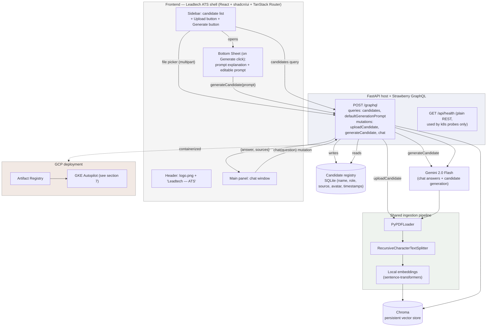
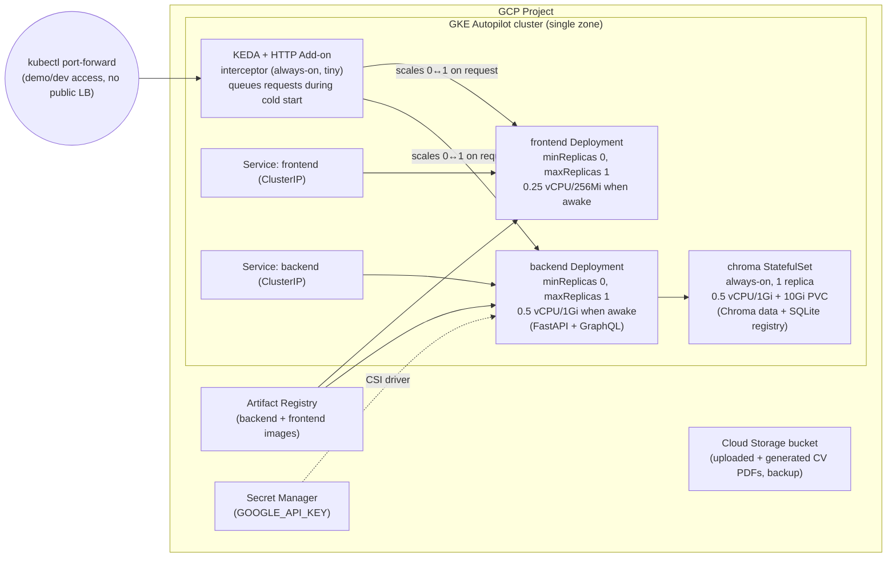

# Leadtech ATS — AI-Powered CV Screener — Implementation Plan

**Source specs:**
- `ai-full-stack-developer-business-case.pdf` (Leadtech — Full-Stack AI Engineer technical task)
- `plan-interface.md` (product/UI/stack requirements: branded SaaS shell, candidate list, upload, in-app CV generation, React + shadcn + TanStack Router + GraphQL)
- `logo.png` (Leadtech brand mark, used as-is in the app header)

**Purpose of this document:** a reviewable, end-to-end plan for a RAG-based CV screening SaaS — built with LangChain, FastAPI + GraphQL, React + shadcn/ui + TanStack Router, and Chroma — deployed to GCP via Terraform and Kubernetes, with a cost estimate, for use in a job-interview submission.

---

## 0. Scope note

The business case says hosting is optional and warns against over-engineering. Terraform, Kubernetes, and GCP are your explicit addition on top of that — the app is built **container-first** so the same images run identically via `docker-compose` and on GKE, and the deployment is exercised, not just written and left un-run (§6–§8).

`plan-interface.md` adds two layers on top of the original brief: (1) a branded **ATS SaaS shell** — Leadtech logo + product name, candidate list, upload, and an in-app "generate a synthetic candidate" flow with a visible, editable prompt — and (2) a specific stack: **React + shadcn/ui + TanStack Router + GraphQL**, replacing the plain-`fetch`/REST frontend approach from the earlier draft. This revision updates the plan for that stack change; the RAG core (LangChain + Chroma + grounding prompt) and the GCP/Terraform/K8s deployment are unaffected by it — GraphQL vs. REST is an API-shape decision inside the same FastAPI backend container, not an infra change (confirmed in §8).

---

## 1. Architecture Overview



**Why this shape:**
- **Single GraphQL endpoint** (`POST /graphql`) replaces the earlier multi-route REST surface. Candidate list, upload, generate, and chat all become one queryable/mutable schema instead of four separate route handlers with four separate response shapes — the frontend gets exactly the fields each view needs (e.g. the sidebar's candidate list can request `{id, name, avatarUrl}` without over-fetching a full candidate record).
- **`/api/health` stays plain REST**, deliberately outside GraphQL. Kubernetes liveness/readiness probes expect a fast, dependency-free HTTP GET with a status code — routing that through a GraphQL query would add unnecessary parsing overhead and coupling between infra health checks and the app schema. This is a one-line exception, called out rather than silently kept.
- Upload and generate still terminate in the **same shared ingestion pipeline and registry write** as before — GraphQL changes the transport, not the underlying `ingest_candidate()` / `generate_candidate()` functions.
- **TanStack Router** structures the frontend as real routes (root layout + index route) even though the app is single-page today — this is what "should use tanrouter" asks for, scoped to what the app actually needs rather than inventing extra pages to justify the router.
- **No public Load Balancer / Ingress.** The GCP deployment (§7) exposes nothing via a GCE HTTP(S) Load Balancer — that forwarding rule is a fixed ~$18/month cost regardless of traffic, the single largest line item after compute in the original cost model, and unnecessary for a reviewer-facing demo. Access for the video/demo is via `kubectl port-forward` (§7.1), which is free. See §8 for the recomputed cost.

---

## 2. Component Breakdown

### 2.1 CV Content Generation (shared by the offline script and the in-app "Generate" button)

Goal: 25–30 unique, realistic-looking fake CVs as PDF (photo, contact info, experience, skills, education) — available both as a batch pre-seed and as an on-demand, user-triggered action from the UI.

| Step | Tool | Notes |
|---|---|---|
| Persona/content generation | Gemini 2.0 Flash (Google AI Studio free tier) | A single function, `generate_candidate(prompt: str) -> CandidateJSON`, used by (a) `scripts/generate_cvs.py` for batch pre-seeding, and (b) the `generateCandidate` GraphQL mutation for one-off, user-triggered generation. Returns **structured JSON** (name, title, summary, 3–5 jobs w/ bullet achievements, skills, education, languages). |
| Default prompt + explanation | Stored server-side (`backend/app/rag/prompts.py`), exposed via the `defaultGenerationPrompt` GraphQL query | Returns `{ explanation, template }`. `explanation` is the human-readable guidance shown above the textarea in the UI; `template` pre-fills the editable textarea in the Generate sheet. One source of truth reused by the batch script, the query, and the mutation. |
| Diversity guardrail (batch seeding only) | Prompt design | Varied (role, industry, seniority, city, tech stack) tuples for the 25–30 pre-seeded candidates, so demo questions have a non-trivial answer set. |
| Avatar photo | A small rotating set of royalty-free/generated placeholder head-shots | Photo realism isn't graded; per-CV image generation is low value for the time it costs. |
| PDF rendering | Jinja2 HTML template + **WeasyPrint** | CSS-styled HTML → PDF, no browser dependency. |
| Output | `{first}_{last}_{uuid}.pdf`, written to storage and registered with `source_type: "generated"` | |

### 2.2 Backend — GraphQL API + RAG Workflow

| Concern | Choice | Rationale |
|---|---|---|
| Orchestration | **LangChain** (Python) | Unchanged — PDF loaders, splitters, retriever, chain abstractions. |
| PDF parsing | `langchain_community.document_loaders.PyPDFLoader` | Unchanged. |
| Chunking | `RecursiveCharacterTextSplitter`, ~800 chars / 100 overlap | Unchanged. |
| Embeddings | `sentence-transformers/all-MiniLM-L6-v2`, local | Unchanged — zero external cost/rate-limit. |
| Vector store | **Chroma**, standalone server (local Docker + GKE `StatefulSet`) | Unchanged. |
| Candidate registry | **SQLite** via SQLModel, colocated on Chroma's persistent volume | Unchanged — right-sized for ~30 rows, zero incremental infra cost. |
| Retrieval | Similarity search, `k=4–6`, optional MMR | Unchanged. |
| Generation (chat) | Gemini 2.0 Flash via `langchain-google-genai`, or OpenRouter free tier | Unchanged. |
| Grounding | System prompt restricts answers to retrieved context, explicit fallback when the CVs don't contain the answer | Unchanged — the main defense against hallucinated candidate facts. |
| Source citation | Retrieved chunks' `source` metadata, deduplicated, returned as a `sources` list field on the GraphQL `ChatAnswer` type | Deterministic citation, not parsed from LLM prose. |
| **API framework** *(changed)* | **FastAPI** as the ASGI host + **Strawberry GraphQL** (`strawberry.fastapi.GraphQLRouter`) mounted at `/graphql` | Strawberry is the natural pick for a FastAPI project: schema defined from Python type hints/dataclasses (mirrors the existing Pydantic-adjacent style), native FastAPI/ASGI integration, and built-in GraphiQL explorer at `/graphql` in the browser for free during dev — useful both for building and for the video's technical-highlight section. |
| File uploads over GraphQL | `strawberry.file_uploads.Upload` scalar on the `uploadCandidate` mutation, implementing the [GraphQL multipart request spec](https://github.com/jaydenseric/graphql-multipart-request-spec) | This is the one genuinely fiddly part of choosing GraphQL for this app — plain REST makes `multipart/form-data` uploads trivial; GraphQL needs client and server to agree on the multipart spec. Strawberry supports it out of the box; the frontend needs a GraphQL client that also implements the spec (see §2.3). Worth calling out explicitly as a deliberate trade-off, not an oversight. |

**GraphQL schema (SDL sketch):**

```graphql
type Candidate {
  id: ID!
  name: String!
  role: String!
  avatarUrl: String
  sourceType: SourceType!   # UPLOADED | GENERATED
  createdAt: DateTime!
}

type PromptTemplate {
  explanation: String!
  template: String!
}

type ChatAnswer {
  answer: String!
  sources: [String!]!
}

type Query {
  candidates: [Candidate!]!
  defaultGenerationPrompt: PromptTemplate!
}

type Mutation {
  uploadCandidate(file: Upload!): Candidate!
  generateCandidate(prompt: String!): Candidate!
  chat(question: String!): ChatAnswer!
}
```

`chat` is modeled as a **mutation**, not a query — a judgment call worth stating explicitly: it triggers a real LLM call with cost/latency and isn't idempotent/cacheable in the way GraphQL queries are conventionally expected to be, so it reads more honestly as a mutation even though it doesn't persist state on our side.

### 2.3 Frontend — Leadtech ATS Shell

| Concern | Choice | Rationale |
|---|---|---|
| Framework | **React** + Vite | Unchanged. |
| Routing | **TanStack Router**, code-based route tree: `__root.tsx` (renders `AppShell` — header + responsive sidebar layout) → `index.tsx` (renders `CandidateList` + `ChatWindow` in the shell's panes) | Deliberately minimal: one real layout route + one index route. The app doesn't need multiple pages today, so the router is scoped to structuring the shell correctly (and being ready for a future `/candidates/:id` route) rather than inventing navigation for its own sake. |
| Component library | **shadcn/ui** (Radix + Tailwind), `components.json` with `baseColor: "neutral"` | Unchanged — this is what constrains the app to black/white/gray/zinc tokens. |
| **Data fetching** *(changed)* | **TanStack Query**, `queryFn`/`mutationFn` wrapping a thin GraphQL client (`graphql-request`) instead of plain REST `fetch` | `graphql-request` is a minimal client (single `request()` call, no separate normalized cache) that pairs cleanly with TanStack Query's own cache/invalidation — avoids running two competing caches, which a heavier client like Apollo would introduce. TanStack Query hooks: `useQuery(['candidates'], ...)`, `useMutation` for upload/generate/chat, invalidating the `candidates` query key on successful upload/generate. |
| File upload client | `graphql-request`'s multipart/`Upload`-scalar support (or a small hand-rolled `FormData` request matching the multipart spec if the library's built-in support doesn't cover the exact shadcn `Dialog` file-input flow cleanly) | Mirrors the server-side spec choice in §2.2 — flagged together since this is one feature spanning both ends. |
| Layout | `AppShell`: header (logo + name) → responsive two-pane body (sidebar + main) | Unchanged. |
| Header | `logo.png` + `"— ATS"` label | Matches `plan-interface.md`. |
| Sidebar | `Button` "Upload candidate" (opens `Dialog`) + `Button` "Generate candidate" (opens bottom `Sheet`), then scrollable `CandidateList` (`Avatar` + name + role + `Badge` for source type) | Unchanged. |
| Upload flow | `Dialog` → file `Input type="file" accept="application/pdf"` → `uploadCandidate` mutation → TanStack Query invalidates the `candidates` query → new row appears | Unchanged in shape, GraphQL under the hood. |
| Generate flow | `Sheet` (`side="bottom"`) → `defaultGenerationPrompt` query populates explanation text + a pre-filled editable `Textarea` → "Generate" button calls `generateCandidate` mutation with the (possibly edited) text | Unchanged in shape, GraphQL under the hood. |
| Chat panel | Message list, text input, "Sources: cv_a.pdf, cv_b.pdf" line under each answer, backed by the `chat` mutation | Unchanged. |
| Responsive | Sidebar collapses into a shadcn `Sheet`-based drawer below `md`, triggered from the header | Unchanged. |
| Theming — color constraint | Neutral/zinc/black/white scale only; no accent token | Unchanged. **One exception, stated explicitly:** `logo.png` renders as-is (real multi-color brand asset) rather than being forced to grayscale — flagged as a decision, with a one-line CSS grayscale filter noted as the alternative if a stricter reading is wanted. |

---

## 3. Local Development Setup (fast inner loop, same images as production)

```
docker-compose.yml
├── backend        # FastAPI + Strawberry GraphQL (/graphql) + LangChain, port 8000
├── frontend        # React + TanStack Router + shadcn build served by nginx, port 5173, proxies /graphql → backend
└── chroma          # standalone Chroma server container (same image used on GKE)
```

```bash
# optional: pre-seed the corpus (also reachable one-by-one via the UI's Generate button)
python scripts/generate_cvs.py --count 28 --out data/cvs

# run the app
docker compose up --build
# → open http://localhost:5173
# → GraphiQL explorer available at http://localhost:8000/graphql for manual query/mutation testing
```

Environment variables (`.env`, not committed): `GOOGLE_API_KEY` (or `OPENROUTER_API_KEY`), `CHROMA_HOST`, `CHROMA_PORT`, `SQLITE_PATH`.

Running `chroma` as its own container locally means the same three-service topology — frontend, backend, chroma — translates 1:1 into the Kubernetes workloads in §7.

---

## 4. Repository Structure

```
.
├── PLAN.md
├── plan-interface.md           # UI/product/stack requirements source
├── logo.png                    # Leadtech brand mark, used in the header as-is
├── README.md
├── docker-compose.yml
├── data/
│   ├── cvs/                    # pre-seeded PDFs
│   ├── app.db                  # SQLite candidate registry
│   └── chroma/                 # local persisted vector index (gitignored)
├── scripts/
│   └── generate_cvs.py         # batch pre-seed, calls the same generate_candidate() as the API
├── backend/
│   ├── app/
│   │   ├── main.py             # FastAPI app; mounts GraphQLRouter at /graphql + GET /api/health
│   │   ├── graphql/
│   │   │   ├── schema.py       # Strawberry schema: Query, Mutation, types
│   │   │   ├── resolvers.py    # candidates / uploadCandidate / generateCandidate / chat
│   │   │   └── types.py        # Candidate, PromptTemplate, ChatAnswer, SourceType
│   │   ├── rag/
│   │   │   ├── loader.py
│   │   │   ├── chain.py        # retrieval chain (LCEL) + grounding prompt
│   │   │   ├── vectorstore.py  # Chroma client wrapper
│   │   │   ├── generator.py    # generate_candidate(), shared by script + resolver
│   │   │   └── prompts.py      # default generation prompt + explanation text
│   │   └── registry.py         # SQLModel candidate table + CRUD
│   ├── Dockerfile
│   └── requirements.txt
├── frontend/
│   ├── components.json         # shadcn config, baseColor: neutral
│   ├── src/
│   │   ├── main.tsx             # TanStack Router setup (createRouter, RouterProvider)
│   │   ├── routes/
│   │   │   ├── __root.tsx       # AppShell layout route (header + responsive sidebar)
│   │   │   └── index.tsx        # CandidateList + ChatWindow
│   │   ├── components/
│   │   │   ├── AppShell.tsx
│   │   │   ├── Header.tsx
│   │   │   ├── CandidateList.tsx
│   │   │   ├── UploadCandidateDialog.tsx
│   │   │   ├── GenerateCandidateSheet.tsx
│   │   │   ├── ChatWindow.tsx
│   │   │   └── MessageBubble.tsx
│   │   └── lib/
│   │       ├── graphql-client.ts   # graphql-request instance
│   │       └── queries.ts          # gql documents + TanStack Query hooks
│   ├── Dockerfile
│   └── package.json
├── infra/
│   ├── terraform/
│   │   ├── main.tf, variables.tf, outputs.tf
│   │   ├── modules/gke/
│   │   ├── modules/artifact-registry/
│   │   └── modules/networking/
│   └── k8s/
│       ├── backend-deployment.yaml
│       ├── frontend-deployment.yaml
│       ├── chroma-statefulset.yaml   # also hosts the SQLite file on the same PVC, see §7.3
│       ├── services.yaml
│       ├── http-scaledobjects.yaml   # KEDA HTTPScaledObject × 2 (frontend, backend) — no ingress.yaml, see §7.1
│       └── secret.yaml (templated, not committed with real values)
└── docs/
    └── architecture-diagram.png (or the mermaid source above, rendered)
```

---

## 5. Design Reference — `plan-interface.md` traceability

| Requirement (`plan-interface.md`) | Where it's addressed |
|---|---|
| "Should be a saas with in top the name of company Leadtech — ATS, follow logo.png" | §2.3 Header row |
| "should be responsive" | §2.3 Responsive row |
| "should use shadcn" | §2.3 Component library row |
| "should use react" | §2.3 Framework row |
| "should use tanrouter" | §2.3 Routing row, §4 `src/routes/` |
| "should use graphql" | §2.2 API framework row, GraphQL schema sketch, §2.3 Data fetching row |
| "colors should only black and white and tones of gray" | §2.3 Theming row, exception for the logo asset flagged explicitly |
| "a list of uploaded candidates" | §2.2 `candidates` query, §2.3 `CandidateList` component |
| "a button to upload a candidate" | §2.3 Upload flow, `UploadCandidateDialog`, §2.2 GraphQL multipart upload |
| "a button to gen a candidate, after that should appear a prompt in the bottom with explanation ... and the prompt itself" | §2.3 Generate flow, `GenerateCandidateSheet` |

---

## 6. What Was Cut / Not Built (and why)

- **GraphQL subscriptions** — chat is a request/response mutation, not a streamed subscription. Streaming token-by-token responses over a GraphQL subscription (or SSE) would be a reasonable follow-up for perceived latency, but adds real transport complexity for a POC-scale demo.
- **GraphQL code generation** (e.g. `graphql-codegen`) — types on the client are written by hand against the small, stable schema above rather than generated; reasonable at this schema size, would be the first thing to add if the schema grew.
- Candidate **edit/delete** — list + upload + generate + chat only.
- No drag-and-drop upload — a single `Dialog` + native file picker.
- No saved/reusable prompt library for the Generate panel — the edited prompt is single-use per generation.
- No auth or multi-user sessions — single-tenant POC.
- No custom VPC, private GKE cluster, or Cloud NAT — unnecessary hardening for a POC with no sensitive data.
- SQLite (not Cloud SQL) for the candidate registry — right-sized for ~30 rows; single-writer is a documented limit, not an oversight.
- No CI/CD pipeline built out — the manual deploy sequence in §7.2 is what CI would automate.
- **No public Load Balancer** — deliberately removed to cut a fixed ~$18/month; access is via `kubectl port-forward` (§7.1). A Cloudflare Tunnel pod (outbound-only, free tier) is the documented $0 alternative if a real public URL is wanted later — not built for this submission.
- **Chroma is not scaled to zero** — kept always-on to avoid a cold-start ordering race with the backend; it's also already the cheapest workload, so the savings from scaling it would be marginal (§7.1, §8.1).
- **No Knative migration** — KEDA HTTP Add-on scales the existing plain Deployments directly; adopting Knative Service CRDs would also achieve scale-to-zero but is a bigger structural rewrite than this scope calls for.

---

## 7. GCP Deployment — Terraform + Kubernetes

GraphQL vs. REST is an API-shape decision inside the backend container, not an infra change. Two infra decisions **are** new in this revision, both aimed squarely at cost: (1) no public Load Balancer — access is via `kubectl port-forward`; (2) the app **scales to zero when idle and wakes on the first incoming request**, via the KEDA HTTP Add-on, so cost is driven by actual usage rather than uptime.

### 7.1 Target GCP architecture



**Design choices and why:**

| Decision | Choice | Rationale |
|---|---|---|
| Cluster mode | **GKE Autopilot** | No node pools to size/patch, no cluster management fee, bills per-pod resource request — which is exactly what makes scale-to-zero (below) translate directly into lower cost with no extra node-autoscaling layer. §8.5 shows Standard-mode numbers for comparison, including why Standard makes scale-to-zero more work, not less. |
| **Scale-to-zero, wake-on-request** | **KEDA + the KEDA HTTP Add-on** (`kedacore/keda`, `kedacore/keda-add-ons-http`), one `HTTPScaledObject` per Deployment (frontend, backend), `minReplicaCount: 0`, `maxReplicaCount: 1`, idle scale-down window ~5 min | The interceptor sits in front of both Deployments, holds/queues the first incoming request while the target pod cold-starts, then forwards it — so "wake on request" doesn't drop or error the request that caused the wake-up. This is the standard scale-to-zero pattern for plain Kubernetes Deployments (as opposed to migrating to Knative Service CRDs, which would also work but is a bigger structural change for a POC that's already built on ordinary Deployments). |
| **Chroma is deliberately excluded from scale-to-zero** | `chroma` StatefulSet stays always-on | Two reasons: (a) it's already the cheapest workload (§8.1), so scaling it saves little; (b) scaling it would create a cold-start ordering dependency — the backend waking up would need to wait on Chroma also waking up before it could serve a retrieval query, adding latency and a real "is Chroma ready yet" race condition to handle. Keeping the vector store warm and only cycling the request-facing tiers (frontend, backend) is the better cost/complexity trade for this scope — stated explicitly as a deliberate simplification, not an oversight. |
| No public Load Balancer / Ingress | Removed entirely — no `Ingress` resource, no `Service type: LoadBalancer` | A GCE HTTP(S) Load Balancer forwarding rule is a **fixed** ~$18/month regardless of traffic — the opposite of the "sleep when idle" goal. Access for development and the demo recording is `kubectl port-forward svc/<name> <port>:<port>` against the (ClusterIP) service in front of the KEDA interceptor — free, and sufficient for a Loom-recorded demo rather than a permanently public URL. If a real clickable link is wanted later, a Cloudflare Tunnel pod (outbound-only, free tier) is the documented $0 alternative — not built for this submission, see §6. |
| Secrets | GCP Secret Manager via CSI driver | Keeps the Gemini/OpenRouter key out of images, Terraform state, and committed YAML. |
| Container images | Artifact Registry (regional, same region as the cluster) | Avoids Docker Hub rate limits, fast same-region pulls. |
| Networking | Default VPC / auto-mode subnet | No compliance requirement, no real PII — a custom VPC/private cluster/Cloud NAT would be over-engineering for this scope. |
| CV file backup | Cloud Storage bucket, written alongside the PVC on every upload/generate | Cheap, and means the PVC isn't the only copy of uploaded/generated PDFs. |

### 7.2 Terraform module sketch

```hcl
# infra/terraform/main.tf (sketch — not exhaustive)
module "artifact_registry" {
  source     = "./modules/artifact-registry"
  project_id = var.project_id
  region     = var.region
  repo_name  = "cv-screener"
}

module "gke" {
  source       = "./modules/gke"
  project_id   = var.project_id
  region       = var.region
  cluster_name = "leadtech-ats-poc"
  autopilot    = true
}

resource "google_secret_manager_secret" "llm_api_key" {
  secret_id = "leadtech-ats-llm-api-key"
  replication { auto {} }
}

resource "google_storage_bucket" "cv_source" {
  name                         = "${var.project_id}-leadtech-ats-cvs"
  location                     = var.region
  force_destroy                = true
  uniform_bucket_level_access  = true
}

# KEDA + HTTP Add-on installed declaratively via the Helm provider,
# keeping the scale-to-zero layer in the same terraform apply as the cluster.
resource "helm_release" "keda" {
  name       = "keda"
  repository = "https://kedacore.github.io/charts"
  chart      = "keda"
  namespace  = "keda"
  create_namespace = true
}

resource "helm_release" "keda_http_add_on" {
  name       = "keda-http-add-on"
  repository = "https://kedacore.github.io/charts"
  chart      = "keda-add-ons-http"
  namespace  = "keda"
  depends_on = [helm_release.keda]
}
```

- Modules split by concern (`gke`, `artifact-registry`, `networking`), remote state on a GCS bucket (created once, out-of-band, before the rest of `apply` runs).
- Deploy sequence: `terraform apply` (cluster, registry, secret, bucket, KEDA + HTTP Add-on via Helm) → build & push images → `kubectl apply -f infra/k8s/` (Deployments, StatefulSet, Services, `HTTPScaledObject`s) → smoke test via `kubectl port-forward` (both the app and `/graphql`), confirming a cold request after idle actually wakes the pods.

### 7.3 Kubernetes manifests — key points

- `backend-deployment.yaml`: readiness probe on `/api/health` (the plain-REST exception from §1), explicit resource `requests`/`limits`, `CHROMA_HOST` env var, API key mounted from the Secret Manager–backed k8s Secret, `SQLITE_PATH` on the shared PVC subpath. **No `replicas` field pinned** — KEDA's `HTTPScaledObject` owns the replica count (0 or 1).
- `chroma-statefulset.yaml`: `volumeClaimTemplates` with a 10Gi standard persistent disk, mounted at `/data`; Chroma writes under `/data/chroma`, the backend's SQLite file lives under `/data/registry` via a `subPath` mount into the backend pod. Fixed at 1 replica — not managed by KEDA (§7.1).
- `services.yaml`: `ClusterIP` for backend↔chroma (internal), `ClusterIP` for frontend/backend — both are **targets** of the KEDA interceptor, not directly internet-facing.
- `http-scaledobjects.yaml`: two `HTTPScaledObject` resources (frontend, backend) — `host`, target `service`/`port`, `minReplicaCount: 0`, `maxReplicaCount: 1`, `scaledownPeriod: 300` (5 minutes idle before scaling back to zero). This file replaces the `ingress.yaml` that would otherwise be here — there is no Kubernetes `Ingress` resource in this deployment.

### 7.4 What this demonstrates

- Deployment vs. StatefulSet judgment, and a deliberate choice to colocate a small relational file with the vector store instead of reaching for a second managed database.
- Autopilot vs. Standard evaluated with real numbers (§8.5), not asserted.
- A real scale-to-zero implementation (KEDA HTTP Add-on) rather than just "Kubernetes can autoscale" — including the request-queueing cold-start problem and why Chroma was deliberately left out of it.
- Secrets kept out of images/state/YAML via Secret Manager + CSI.
- A Terraform module layout that mirrors how this would grow, rather than one monolithic `main.tf`.

---

## 8. Cost Estimate (GCP, `us-central1`, POC scope)

All figures are **estimates** based on published GCP list pricing as of early/mid-2026; verify against the [GCP Pricing Calculator](https://cloud.google.com/products/calculator) before treating them as final. No committed/sustained-use discounts assumed; no free-trial credit applied — see §8.6.

Two changes since the previous revision, both cost-driven: (1) no Load Balancer (§7.1) — removes a flat ~$18/month regardless of usage; (2) frontend + backend **scale to zero when idle and wake on request** via KEDA — turns "cost while deployed" into "cost while actually used." GraphQL vs. REST itself remains a **$0** infra delta — same container count, same resource sizing, same persistent volume.

### 8.1 Workload sizing assumption

| Pod | vCPU request | Memory request | Scaling | Notes |
|---|---|---|---|---|
| frontend (nginx, React + shadcn + TanStack Router bundle) | 0.25 | 0.5 Gi | 0↔1 via KEDA | |
| backend (FastAPI + Strawberry GraphQL + LangChain + local embeddings + SQLite) | 0.5 | 1 Gi | 0↔1 via KEDA | Cold start includes loading the sentence-transformers embedding model into memory — see §8.4 for the latency trade-off |
| chroma (StatefulSet) | 0.5 | 1 Gi | **always 1** (not scaled, §7.1) | Trivial corpus size |
| KEDA operator + HTTP Add-on interceptor | ~0.2 | ~0.3 Gi | always-on (this *is* the always-on front door) | Small, fixed system overhead — the cost of having scale-to-zero at all |

### 8.2 GKE Autopilot — cost model: idle vs. active

Because frontend and backend scale to zero, there are two rates instead of one flat monthly number:

| State | What's running | vCPU | Memory | Rate |
|---|---|---|---|---|
| **Idle** (no requests for 5+ min) | chroma + KEDA interceptor only | 0.7 | 1.3 Gi | **≈ $0.0375/hr** |
| **Active** (frontend + backend awake) | all four workloads | 1.45 | 2.8 Gi | **≈ $0.0782/hr** |

Fixed costs on top of either state, all small:

| Item | Rate | Monthly |
|---|---|---|
| Persistent disk (10Gi, Chroma + SQLite) | ~$0.04/GB-month | **$0.40** |
| Artifact Registry storage | ~$0.10/GB-month | **< $0.50** |
| Cloud Storage (CV PDF backups, few MB) | ~$0.02/GB-month | **< $0.05** |
| Secret Manager | free tier | **$0.00** |
| Load Balancer | — removed, see §7.1 | **$0.00** |

| Ceiling scenarios | Monthly |
|---|---|
| Never scales down (defeats the purpose — for comparison only) | 0.0782 × 730 + $0.95 ≈ **$58/month** |
| Truly idle the entire month, zero requests ever | 0.0375 × 730 + $0.95 ≈ **$28.3/month** |

### 8.3 Realistic cost for the actual review use case

A reviewer opening the app a handful of times over a multi-day window spends most of that window idle:

| Scenario | Idle time | Active time | Estimated cost |
|---|---|---|---|
| Demo recording session (actively driving it) | 0 hrs | ~1 hr | **≈ $0.08** |
| Left live for a full review day, ~30 min of actual clicking | 7.5 hrs | 0.5 hrs | **≈ $0.32** |
| Left live for a 3-day review window, ~1 hr of actual use total | 71 hrs | 1 hr | **≈ $2.74** |
| Left live for a full month, ~5 hrs of actual use total | 725 hrs | 5 hrs | **≈ $27.6** |

**This is the headline number:** deploying via `terraform apply` and leaving it live for the *entire* multi-day review window — not tearing it down at all — costs on the order of **$1–3 total**, because it's asleep for nearly all of that window. That's a materially better story for a live, clickable-during-review deployment than the earlier "destroy immediately to control cost" guidance, and it's what scale-to-zero is for.

### 8.4 Trade-off: cold-start latency

Scale-to-zero isn't free in UX terms — the request that wakes a sleeping pod waits on that pod's cold start. For this stack: frontend cold start is fast (static nginx, ~1–2s); backend cold start is the one to watch — pulling the container image (fast if cached on the node) plus loading the sentence-transformers embedding model into memory, realistically **a few seconds to ~10s** on first request after idle. The KEDA HTTP Add-on interceptor queues that first request rather than dropping it, so the user just sees a slower first response, not an error. `scaledownPeriod: 300` (5 min) is a tunable balance — shorter saves more when idle, longer avoids repeated cold starts during an active review session; worth stating as a configurable trade-off in the video rather than a fixed answer.

### 8.5 LLM / embedding API cost

| Item | Cost |
|---|---|
| Embeddings (local, in-container) | **$0.00** |
| Gemini 2.0 Flash — chat answers + on-demand candidate generation, free tier | **$0.00** at demo volume (order of 1M tokens/day free) |
| Paid-model fallback, worst case | **< $0.25** for a full review session including several "Generate candidate" clicks |

### 8.6 GKE Standard, for comparison

Standard mode complicates scale-to-zero rather than simplifying it: KEDA can still scale pod replicas to zero, but Standard bills by **node**, not by pod — so the underlying VM(s) keep costing money unless the **node pool itself** also scales down (cluster autoscaler with `--min-nodes=0`), which adds a second autoscaling layer on top of KEDA and a slower cold-start path (provisioning a fresh VM is much slower than Autopilot binpacking a pod onto already-available capacity). Autopilot's per-pod billing means the KEDA savings in §8.2 are realized directly, with no additional node-level autoscaling to configure — a concrete reason (not just "less ops") to prefer Autopilot once scale-to-zero is in the picture. Standard's flat-rate numbers, for reference: 2 × `e2-small` nodes ≈ $24.5/month continuous, zonal cluster management fee waived for the first cluster — but that's the *always-on* figure, since realizing any idle savings on Standard requires the extra node-autoscaling work described above.

### 8.7 Free credit

New GCP billing accounts get **$300 of free credit for 90 days** (verify current terms at signup). Even without the credit, the realistic figures in §8.3 mean this entire exercise — deployed and left live for the whole review window — costs a few dollars at most; with the credit, it's **$0 out of pocket** either way.

---

## 9. Timeline Mapping (2-day deadline)

Roughly **50% RAG/backend (incl. GraphQL schema), 30% frontend shell (incl. TanStack Router setup), 20% infra + docs + video** — the stack change from REST to GraphQL + TanStack Router adds a modest, one-time setup cost (schema definition, router scaffolding) but doesn't change the size of the feature surface being built.

| Time block | Work |
|---|---|
| Day 1 AM | Backend RAG core: ingestion pipeline, Chroma indexing, retrieval chain, grounding prompt; candidate registry (SQLite) + shared `generate_candidate()` / `ingest_candidate()` functions |
| Day 1 PM | GraphQL layer: Strawberry schema + resolvers (`candidates`, `defaultGenerationPrompt`, `uploadCandidate` w/ multipart, `generateCandidate`, `chat`); pre-seed 25–30 candidates via the batch script; exercise the schema via the GraphiQL explorer before touching frontend |
| Day 2 AM | Frontend shell: TanStack Router setup (`__root`, `index`), `AppShell` (header + responsive sidebar), `CandidateList`, `UploadCandidateDialog`, `GenerateCandidateSheet`, `ChatWindow` — wired via TanStack Query + `graphql-request`, shadcn `neutral` theme applied throughout |
| Day 2 PM (first half) | `docker-compose` end-to-end pass (matches eventual k8s topology) → `terraform apply` (GKE Autopilot, Artifact Registry, Secret Manager, GCS, KEDA + HTTP Add-on via Helm) → build & push images → `kubectl apply` (Deployments, StatefulSet, Services, `HTTPScaledObject`s) → smoke test via `kubectl port-forward`, confirming pods scale to zero after ~5 min idle and wake on the next request |
| Day 2 PM (second half) | README, this plan doc, architecture diagram export, Loom recording |

---

## 10. Video Demo Outline

1. **The Process (~1 min):** show the app header/branding, the candidate list, and 1–2 CV PDFs; briefly show the ingestion step (chunking + Chroma).
2. **The Demo (~2.5 min):** upload a candidate via the sidebar button; click "Generate candidate," show the explanation + editable prompt in the bottom sheet, generate one; ask the brief's example questions in the chat panel — *"Who has experience with Python?"*, *"Which candidate graduated from UPC?"*, *"Summarize the profile of \<name\>"* — and show the sources line under each answer.
3. **Technical Highlight (~1–1.5 min):** pick one of — (a) the single shared ingestion path behind upload/generate/batch-seed, exposed through one GraphQL schema instead of four REST routes, (b) the GraphQL multipart file-upload spec as the one genuinely fiddly integration point, (c) the grounding prompt design, (d) **scale-to-zero in action** — run `kubectl get pods -w` in a terminal, let the app sit idle until frontend/backend drop to 0 replicas, then fire a request and watch them scale back to 1, with the real idle-vs-active cost numbers from §8.3.
