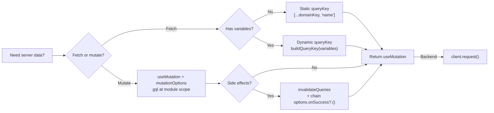

# API Architecture

GraphQL (`graphql-request`) + TanStack React Query v5.

## Decision Diagram



## Client (`src/lib/client/client.ts`)

```ts
client.request(...)        // real backend
```

## Codegen

| Schema                              | Generated types |
| ----------------------------------- | --------------- |
| Fetched from backend URL at runtime | `src/graphql/`  |

Run `yarn gql` after schema changes.

## Rules

1. **`src/api/`** — all runtime API code. **`src/graphql/`** — codegen only (no runtime code).
   1b. **GraphQL Args types are mandatory** — when adding or modifying a GraphQL query/field that accepts arguments, you **must** also create or update the corresponding `*Args` type in `src/graphql/graphql.ts`. For example, a field `activityLog(search: String, date: String)` must have a matching `VendorActivityLogArgs` type exported from `graphql.ts`. Never add query arguments without their frontend type definition.
   1c. **Use Args types in TVariables** — when a hook's query passes arguments to a GraphQL field, `TVariables` must compose from the corresponding `*Args` type. E.g. `export type TVariables = { id: string } & VendorActivityLogArgs`. Never duplicate argument fields manually in `TVariables`.
2. **One file per hook**: `use-[name].ts`. Never `queries.ts` or `mutations.ts`.
3. **Domain directories**: `src/api/vendors/`, `src/api/dashboard/`, etc. Each has `key.ts` + `index.ts`.
4. **Query keys**: prefixed with domain key + kebab-case string. E.g. `[...vendorsKey, 'use-vendor-detail']`.
5. **`gql` at module scope** — never inside the hook body. Declare as a `const` at the top of the file.
6. **Export named options** — always export `xQueryOptions` / `xMutationOptions` at module scope. For hooks with variables, export as a function returning `queryOptions(...)`.
7. **Export `TVariables` and `TData`** from every hook file, declared before the hook.
8. **Variables**: single `variables` object, never individual params.
9. **No standalone fetch functions** — never create `async function fetch*()` wrappers. Call `client.request()` directly in `queryFn`/`mutationFn`.
10. **Options type** — derive from `typeof xQueryOptions` (no variables) or `ReturnType<typeof xQueryOptions>` (with variables), never manual `UseQueryOptions<...>`.
11. **`buildQueryKey`** (`src/api/build-query-key.ts`) — use for hooks with variables.
12. **Mutations with side-effects** — chain caller's `onSuccess` via `options.onSuccess?.(...args)`.
13. **Use generated Payload and Input types** — mutation hooks must use codegen types from `@/graphql/graphql` for both `TData` and `TVariables`. Never manually define inline types that duplicate the generated schema.
    - `TData`: use `Pick<Mutation, 'mutationName'>` — never inline `{ success: boolean; ... }`.
    - `TVariables`: use `Omit<SomeMutationInput, 'clientMutationId'>` or compose from the generated `*Input` type — never manually redeclare `{ id: string; fieldName: string }`.
    - ✅ `export type TData = Pick<Mutation, 'toggleVendorFramework'>`
    - ✅ `export type TVariables = Omit<ToggleVendorFrameworkInput, 'clientMutationId'>`
    - ❌ `export type TData = { toggleVendorFramework: { success: boolean } }`
    - ❌ `export type TVariables = { vendorId: string; frameworkName: string }`

## Query Hook (no variables)

```ts
// src/api/vendors/use-vendors.ts
import { queryOptions, useQuery } from '@tanstack/react-query'
import { gql } from 'graphql-request'

import type { GetVendorsQuery } from '@/graphql/graphql'

import { client } from '../client'
import { vendorsKey } from './key'

export type TVariables = void
export type TData = GetVendorsQuery['vendors']

export const vendorsListKey = [...vendorsKey, 'vendors'] as const

const graphql = gql`
  query vendors {
    vendors {
      id
      name
    }
  }
`

export const vendorsQueryOptions = queryOptions({
  queryKey: vendorsListKey,
  queryFn: () => client.request<GetVendorsQuery>(graphql),
})

export const useVendors = (
  options: Omit<typeof vendorsQueryOptions, 'queryKey' | 'queryFn'> = {},
) => useQuery({ ...vendorsQueryOptions, ...options })
```

## Query Hook (with variables)

```ts
// src/api/vendors/use-vendor.ts
import { queryOptions, useQuery } from '@tanstack/react-query'
import { gql } from 'graphql-request'

import type { GetVendorQuery } from '@/graphql/graphql'

import { buildQueryKey } from '../build-query-key'
import { client } from '../client'
import { vendorsKey } from './key'

export type TVariables = { id: string }
export type TData = GetVendorQuery['vendor']

const MOCK: TVariables = { id: '' }

export const vendorKey = (variables: TVariables = MOCK) =>
  [
    ...vendorsKey,
    'vendor',
    ...buildQueryKey({ ...MOCK, ...variables }),
  ] as const

const graphql = gql`
  query vendor($id: ID!) {
    vendor(id: $id) {
      id
      name
    }
  }
`

export const vendorQueryOptions = (variables: TVariables = MOCK) =>
  queryOptions({
    queryKey: vendorKey(variables),
    queryFn: () => client.request<GetVendorQuery>(graphql, variables),
    enabled: !!variables.id,
  })

export const useVendor = (
  variables: TVariables = MOCK,
  options: Omit<
    ReturnType<typeof vendorQueryOptions>,
    'queryKey' | 'queryFn'
  > = {},
) => useQuery({ ...vendorQueryOptions(variables), ...options })
```

## Mutation Hook

```ts
// src/api/vendors/use-toggle-vendor-active.ts
import {
  mutationOptions,
  useMutation,
  useQueryClient,
} from '@tanstack/react-query'
import { gql } from 'graphql-request'

import type { ToggleVendorActiveMutation } from '@/graphql/graphql'

import { client } from '../client'
import { vendorsListKey } from './use-vendors'

export type TVariables = { id: string }
export type TData = ToggleVendorActiveMutation['toggleVendorActive']

const graphql = gql`
  mutation toggleVendorActive($id: ID!) {
    toggleVendorActive(id: $id) {
      id
      isActive
    }
  }
`

export const toggleVendorActiveMutationOptions = mutationOptions({
  mutationFn: (variables: TVariables) =>
    client.request<ToggleVendorActiveMutation>(graphql, variables),
})

export function useToggleVendorActive(
  options: Omit<typeof toggleVendorActiveMutationOptions, 'mutationFn'> = {},
) {
  const queryClient = useQueryClient()

  return useMutation({
    ...toggleVendorActiveMutationOptions,
    ...options,
    onSuccess: (...args) => {
      queryClient.invalidateQueries({ queryKey: vendorsListKey })
      options.onSuccess?.(...args)
    },
  })
}
```

## Domain index.ts

```ts
export { vendorsKey } from './key'
export { useVendors, vendorsListKey, vendorsQueryOptions } from './use-vendors'
export {
  useToggleVendorActive,
  toggleVendorActiveMutationOptions,
} from './use-toggle-vendor-active'
```

## Using Hooks in Components

```tsx
import { useToggleVendorActive, useVendors } from '@/api'

function VendorList() {
  const { data: vendors, isLoading } = useVendors()
  const { mutate: toggleActive } = useToggleVendorActive({
    onSuccess: () => toast.success('Toggled!'),
  })

  const handleToggle = useCallback(
    (id: string) => toggleActive({ id }),
    [toggleActive],
  )

  if (isLoading) return <Skeleton />
  return vendors?.map((v) => (
    <VendorCard key={v.id} vendor={v} onToggle={handleToggle} />
  ))
}
```

## Using Options Directly (e.g. Route Loaders)

Export named options constants so they can be used outside hooks (loaders, prefetching, server-side):

```ts
// In a route file
import { vendorsQueryOptions } from '@/api'

export const Route = createFileRoute('/vendors')({
  loader: ({ context: { queryClient } }) =>
    queryClient.ensureQueryData(vendorsQueryOptions),
  component: VendorsPage,
})
```

## Backend Migration (per hook)

1. `client.request(...)` → `client.request(...)`
2. For `client.request`, use `Pick<Query, 'fieldName'>` as the type parameter (not the extracted field type)
3. Adjust query fields if schemas differ

# API Layer Conventions

## Mutation Response Handling

All GraphQL mutations return a payload with the following standard fields:

```ts
{
  success: boolean
  errors?: string[] | null
  errorCode?: ErrorCodeEnum | null
}
```

### Pattern

When calling a mutation, always handle the `onSuccess` and `onError` callbacks:

```ts
mutate(variables, {
  onSuccess: (data) => {
    if (data?.success) {
      toast.success(t('...success_key'))
    } else {
      toast.error(resolveApiError(data?.errorCode, data?.errors, t))
    }
  },
  onError: () => toast.error(t('common.error')),
})
```

> **Note:** The `data` in per-call `onSuccess` is typed as the mutation payload directly
> (e.g. `UpdateFrameworkCheckResponsePayload`), not the top-level `Pick<Mutation, '...'>` wrapper.
> Access fields directly: `data?.success`, `data?.errorCode`, `data?.errors`.

### Error Resolution — `resolveApiError`

Located at `src/lib/api-error.ts`. Resolves an API error to a human-readable string using this priority:

1. **Known error code** — if `errorCode` maps to a translated key in `common.error_codes`, returns the translation.
2. **Server error messages** — if `errors` array is present, joins them with `, `.
3. **Generic fallback** — returns `t('common.error')`.

```ts
import { resolveApiError } from '@/lib/api-error'

toast.error(resolveApiError(data?.errorCode, data?.errors, t))
```

### Error Code Translations

All known API error codes are translated in `common.error_codes` across all locale files:

| Key                | Description                                 |
| ------------------ | ------------------------------------------- |
| `FORBIDDEN`        | User lacks permission for the action        |
| `INTERNAL_ERROR`   | Unexpected server error                     |
| `NOT_FOUND`        | The requested resource does not exist       |
| `UNAUTHORIZED`     | User is not authenticated                   |
| `VALIDATION_ERROR` | Form/model validation failed on the backend |

### Query Invalidation

Each mutation hook invalidates relevant query keys on success to keep the UI in sync:

```ts
onSuccess: (...args) => {
  queryClient.invalidateQueries({ queryKey: someQueryKey(variables) })
  options.onSuccess?.(...args)
}
```

`invalidateQueries` marks the query stale and triggers a refetch using the same variables
(including any active filters), so no extra work is needed on the call site.
